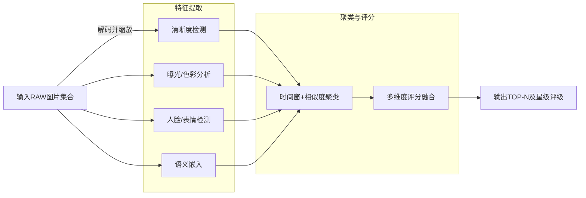

# RapidRAW AI选图 功能设计与实现方案

**执行摘要：** 本方案旨在为RapidRAW添加端侧AI“智能选图”功能，通过多维度图像质量评估自动筛选最佳照片。系统对每张图片输出综合评分（映射为1–5星）和推荐标签（推荐/备选/不推荐），并提供简要原因（如“模糊”、“脸部闭眼”等）。核心维度包括：**清晰度**（通过拉普拉斯算子方差衡量焦点清晰度【10†L228-L236】）、**曝光与色彩健康度**（分析亮度直方图和白平衡等）、**去重/连拍检测**（基于语义特征嵌入进行相似度聚类）、**人脸与表情**（检测人脸位置并识别闭眼、笑容等）、**构图与美学**（使用美学打分模型如NIMA【27†L248-L257】结合简单规则）。我们推荐使用MediaPipe（面部检测、Mesh）【23†L37-L40】【48†L237-L240】、CLIP或DINO-V2等嵌入模型、ONNX Runtime和FAISS/Annoy等开源库（许可友好、支持本地运行）来落地实现。系统架构采用批处理流水线：输入RAW图像→多线程特征提取（清晰度、曝光、面部、语义嵌入等）→按时间窗分组和近邻索引避免全量比较→多指标加权融合评分→输出Top-N排序。去重与相似度匹配复杂度由**O(N²)**降至近线性【56†L1-L3】【16†L300-L307】。下文详细列出每个模块的实现方案、技术选型比较、系统流程（见Mermaid流程图）、开发计划和测试策略，确保方案可落地、工程化。

## 1. 目标与输出

- **用户场景：** 摄影师在导入大量RAW照片后，希望快速筛选出最佳成片，如婚礼摄影、活动摄影等。  
- **最终交付：** 
  - **评分/排序：** 对每张图片给出综合质量分（1–5星）和总分（例如0–100分）。  
  - **推荐标签：** 标记“推荐/备选/不推荐”，辅助区分优劣。  
  - **TOP-N列表：** 按评分降序输出前N张（N可配置），供用户优先查看。  
  - **可解释信息：** 提供主要评分原因（如“焦点模糊”、“曝光不足”、“微笑”），增强用户信任。  
- **输出格式：** 可以是`.rrdata`或JSON列表，包括每张图像的ID、各子评分、总分、星级、标签和说明。

## 2. 必要功能维度

为满足摄影业务需求，我们需要从多角度评价照片质量，主要维度包括：

- **清晰度（对焦）**：检测照片是否失焦或运动模糊。常用方法是计算灰度图的拉普拉斯方差（Laplacian Variance），值越高表示越清晰【10†L228-L236】。  
- **曝光/色彩健康度**：分析直方图过曝/欠曝区间、平均亮度、白平衡是否合理等。可利用OpenCV、Exif元数据或Raw数据函数评估曝光、饱和度分布。  
- **去重/连拍**：在连续拍摄或误触快门情况下，自动识别重复或近似帧。例如对同一主题近似连拍只保留最佳一张。  
- **人脸检测与表情**：对有人像照片尤为重要。需要检测人脸位置并识别闭眼、微笑等表情。若检测到闭眼，则应降低评分。  
- **构图/美学评分**：从语义和美学角度评分，如是否主次分明、主题居中或符合作品风格（如黄金分割）。可借助预训练美学模型（如NIMA【27†L248-L257】）或基于CLIP特征训练轻量回归模型。  
- **其它因素**：包括ISO噪声、动态范围（夜景噪点、多逆光程度）、元数据利用（如照片拍摄时间、焦距、光圈、快门速度等用于时间窗分组或参考）等。

## 3. 各维度的工程化实现方案

我们按照优先级分别实现各评分维度的MVP算法，同时考虑替代方案和运行效率。

- **清晰度检测：**  
  - **方法：** 使用OpenCV计算图像灰度的拉普拉斯算子方差【10†L228-L236】，作为焦点测度 (focus measure)。值越低代表更模糊。  
  - **替代方案：** 只计算图像梯度（Sobel）或FFT高频能量，耗时更低。  
  - **输入/输出：** 输入RGB图像，输出模糊分数（单值）。  
  - **阈值：** 实验发现阈值因场景而异，可初定 ~100 左右作二分类【10†L218-L221】。例如文中将低于100判为“模糊”【10†L218-L221】。  
  - **性能：** 基于像素计算，单张512×512图像耗时极低（<5ms），可多线程并行。支持全离线CPU计算。  
- **曝光/色彩健康：**  
  - **方法：** 分析图像直方图：计算过曝像素比例（R/G/B通道均接近255比例）和欠曝比例；计算平均亮度或曝光指数；评估白平衡偏移（例如偏蓝/偏黄）。如QRaw已有自动曝光分析函数，可移植到C++/Rust。  
  - **替代方案：** 使用已开源的图像分析函数库，如谷歌的Vision API算法概念、OpenCV直方图统计。  
  - **输入/输出：** 输入RAW或sRGB图像，输出曝光评分（0-100）和色彩偏离度。  
  - **阈值：** 定性提示：过曝/欠曝超过一定比例即扣分。具体阈值依实测调优。  
  - **性能：** 主要数组统计，CPU耗时极低，可实时完成。  
- **重复/连拍检测：**  
  - **时间窗聚类：** 首先按拍摄时间（EXIF `DateTime` 或帧编号）划分小组，如5秒内连拍的照片视为一组，组内照片主体相似。这样大幅减少后续对比次数。  
  - **语义嵌入：** 对每张图片提取语义特征向量，例如使用CLIP（512维）或DINO-v2（384维）模型。HuggingFace的CLIP模型可以直接用Python/PyTorch推理，或导出ONNX。  
  - **近邻检索：** 对每个时间窗小组内，用Faiss或Annoy构建向量索引，查询最近邻。Faiss（Meta开源）是C++高效实现，支持GPU【16†L300-L307】；Annoy（Spotify Apache-2.0）支持内存映射索引【18†L309-L318】。Faiss适合高维场景，Annoy对内存和多进程友好。  
  - **相似度阈值：** 当两张图片的余弦相似度 >0.92（视场景适当调整）时视为重复。阈值可根据用户偏好调节。  
  - **输出格式：** 为每个小组产生一个“结构化聚类”，组内只保留分数最高的照片，其他标记为候选/淘汰。  
  - **复杂度分析：** 直接全局两两比较复杂度为O(N²)【56†L1-L3】。采用时间窗分组和近邻索引后，近似将复杂度降至线性级别，并行化查询后每张图与少量候选比对。  
- **人脸检测与表情：**  
  - **人脸检测：** 可选MediaPipe FaceDetector（5点人脸框）或FaceMesh（468点面部关键点）【48†L237-L240】。FaceMesh输出468个3D关键点，能够定位左/右眼虹膜、嘴唇等【23†L37-L40】【48†L237-L240】。对于移动端实时性，可先用轻量RetinaFace ONNX（5点）或MediaPipe，再进行第二阶段识别。  
  - **闭眼/表情识别：** 若检测到人脸，截取眼部区域后用简单分类器判断是否闭眼。常用方法是计算眼睛长宽比(EAR)；或者训练小型卷积网络输入眼睛ROI输出“闭眼/张眼”概率。类似地，可检测嘴部微笑（使用Facial Action Coding或直接二分类）。  
  - **输入/输出：** 输入图片，输出每张含人像照片的面部分数（如正面、闭眼程度、笑容强度）。如闭眼则扣除高分。  
  - **模型推荐：** MediaPipe FaceMesh（APACHE2许可）提供全脸关键点【48†L237-L240】；亦可参考biubug6的Face-Detector-1MB模型（MIT许可）【25†L7-L15】用于快速部署。阶段二表情识别模型可用轻量CNN或TensorFlow/Lite网络。  
- **构图/美学评分：**  
  - **方法：** 首先使用规则方法：如统计主体偏离画面中心距离（基于面部或视觉热区）；计算构图对称性或三分法分数等。其次结合深度学习美学模型：例如使用Google NIMA模型，其输出1-10分的美学评分【27†L248-L257】。已有开源NIMA权重可在ONNX/PyTorch下运行。  
  - **小规模微调：** 可自己构造小规模标注集（几百张照片人工打分），用来微调轻量网络或调整NIMA输出。也可使用CLIP特征加线性回归来拟合评分。  
  - **输入/输出：** 输出构图分数和美感分数。  
  - **性能：** NIMA基于Inception/VGG需要一定计算，可考虑量化或降级网络；规则算法速度极快。  

## 4. 推荐模型/库与版本比较

下表列出关键组件及建议使用的开源实现，并说明选择理由及许可等参数：

| 功能         | 推荐模型/库 (版本)                          | 许可  | 说明                                     |
|------------|---------------------------------------|-----|----------------------------------------|
| **人脸检测**    | MediaPipe FaceMesh (Google)            | Apache-2.0 | 实时人脸关键点模型，输出468个脸部3D点【48†L237-L240】；轻量，移动端可跑；输出精确可检测眼虹膜等。 |
|            | RetinaFace ONNX (ultralight)          | MIT (ONNX)  | ONNX实现的人脸检测，检测五点；体积小，推理快，可本地CPU跑。        |
|            | biubug6 Face-Detector-1MB (2022)      | MIT       | 超轻1MB人脸模型，含5关键点【25†L7-L15】；推理超快，便于离线部署。     |
| **表情检测**    | MediaPipe FaceMesh                  | Apache-2.0 | 同上，可直接获取眼部、嘴部关键点用于计算闭眼、微笑指标。          |
|            | 自定义小CNN（OpenCV/DNN/PyTorch） | BSD       | 在关键点基础上裁剪眼嘴图像，用小型分类网络判断闭眼/笑容。       |
| **语义嵌入**    | OpenAI CLIP ViT-B/32/16 (HuggingFace)  | MIT? (待确认)  | 多模态对比预训练模型，生成512维图像特征，可用于相似度计算。       |
|            | DINO-v2 ViT-S/14 (Meta)             | Apache-2.0? | 自监督ViT模型，提供384维图像嵌入，对语义相似性优于传统CNN。【7†L93-L102】（参考） |
| **美学评分**    | NIMA (Inception/VGG, ONNX)           | Apache-2.0 | Google提出美学评估模型【27†L248-L257】；输出评分分布，可映射为平均分（1-10）。可导出ONNX。 |
|            | 自定义小回归模型                      | BSD       | 可在CLIP特征基础上训练轻量网络或线性回归，适合特定题材微调。      |
| **近邻检索**    | FAISS (1.7.0以上)                  | MIT       | Meta开发，C++/Python库，支持高效ANN搜索、GPU加速【16†L300-L307】。适合数万量级图像。   |
|            | Annoy (1.18+)                       | Apache-2.0 | Spotify发布，C++库，支持磁盘索引和内存映射【18†L309-L318】；内存占用小，多进程友好。  |
| **模型推理**    | ONNX Runtime (最新)                 | MIT       | 通用推理引擎，支持CPU/GPU，可量化模型。微软维护，API易用。        |
|            | PyTorch/LibTorch (1.13+)            | BSD  | 训练和推理框架。若模型不导出ONNX，可直接使用PyTorch，或通过LibTorch在Rust/C++中使用。 |
| **图像处理**    | OpenCV (4.x)                        | BSD       | 常用图像处理库，提供读取、转换、Laplace等算法【10†L228-L236】；速度快，C++/Rust皆可。 |

上述推荐模型均为目前社区成熟方案，许可友好（Apache/MIT/BSD），且有活跃维护。替代方案如InsightFace（2D人脸，MIT许可）也可选，但部署复杂度略高。PyTorch模型可通过TorchScript/LibTorch或ONNX在本地推理。所有模型大小和推理成本需根据硬件（CPU/GPU）权衡，如FAISS可启用GPU加速以提升吞吐。

## 5. 系统架构与流水线

整个系统采用批处理流水线架构，分为多步处理阶段，可并行执行。总体流程图如下：



- **特征提取阶段：** 并行对所有图像进行预处理并提取特征。包括：模糊度分数(`C`)、曝光/色彩分布(`E`)、人脸特征(`S`)、语义特征(`H`)。可使用多线程或批量GPU推理，加速计算。  
- **时间窗分组：** 根据图片拍摄时间(或文件顺序)将近拍照片划为组，减少后续冗余计算。在每个组内，构建FAISS/Annoy索引按特征相似性聚类(`G`)。  
- **多维评分融合：** 对每张图像计算各项子评分后，按照设计权重合并成总分。最终对总分映射到星级及推荐标签(`M`)。可在此阶段并行计算简单加权。  
- **输出结果：** 导出前N张得分最高的照片，以及每张的评分详情和标签。结果可存储到`.rrdata`文件或数据库中，供前端调用。

## 6. 去重与相似度实现细节

- **特征来源：** 推荐使用CLIP或DINO-V2模型在池化层输出的图像特征向量作为embedding。向量维度（如512）要统一，并做`L2`归一化以便使用余弦相似度。  
- **阈值策略：** 经验上，对人像场景Cosine相似度>0.95视为基本相同照片；对无明显主体的风景可以适当放宽至0.90左右。阈值应结合场景测试微调。  
- **时间窗+聚类示例：** 例如将连续5秒内拍摄的照片归为一组，组内使用Faiss构建HNSW图索引【16†L300-L307】，对每张图查找k近邻。对于相似度极高的对，将除最高分外的图片标记为备选/淘汰。  
- **近邻库参数：** 对于5000张图的小批量，Faiss IVF-Flat索引或HNSW（M=16,ef=200）即可达到90%以上召回；Annoy可用10棵树(arbitrary)以减少内存。根据实验结果调整参数。  
- **复杂度分析：** 直接两两比较需要 O(N²)【56†L1-L3】，不可接受。采用时间窗分组后，每组大小M远小于N，可视作近线性时间。索引查询时间为 O(log M)。总体而言，采用聚类+ANN后系统可扩展到成千上万张图像。

## 7. 人脸/闭眼/表情模块实现细节

- **关键点需求：** 闭眼判断需要获取眼睛轮廓关键点(至少6个点)，常规2D人脸检测输出的“眼角”不足以计算眼睛面积比。MediaPipe FaceMesh提供468点，其中包含完整眼睛轮廓和虹膜【48†L237-L240】。RetinaFace等5点检测无法直接获闭眼信息，需要二次分类。  
- **推荐模型：**  
  - **MediaPipe FaceMesh（IPC兼容）**：输出眼、嘴、鼻尖等点【23†L37-L40】；可直接计算眼睛高宽比(EAR)来判闭眼。Apache-2.0许可，支持CPU/GPU。  
  - **RetinaFace ONNX：** 轻量人脸检测，输出5点（两眼角、鼻尖、嘴角）在闭眼检测上相对有限，但可用于判断正脸朝向和粗略评分。  
- **二次训练：** 基于MediaPipe检测到的眼部ROI，如果需要更鲁棒，可训练一个小CNN对“张眼/闭眼”分类。也可使用开源眼睛检测库如Dlib配合阈值法。  
- **示例：** 对于每个检测到的人脸，计算EAR = (|p2–p6|+|p3–p5|)/(2*|p1–p4|)（p1–p6为左眼/右眼轮廓点）。EAR小于某阈值（如0.2）即判闭眼。类似地，可用眉眼距判定眨眼。此阶段并行计算，不影响总体效率。

## 8. 构图/美学评分方案

- **NIMA模型：** Google的NIMA网络【27†L248-L257】（基于深度CNN）能输出1–10分的图像美学评分。我们可以直接使用预训练权重并导出ONNX，加快推理。NIMA输出的是分布，可取均值作为分数。此方法在多种照片上与人工评分高度相关【27†L248-L257】。  
- **规则增强：** 为弥补NIMA可能的风格偏差，可加入简单规则：如将人脸位置偏离画面中心的罚分、景深不明显则扣分等。例如如果面部偏离画布中心超过一定距离，可降低分数。这些规则可对特定摄影风格（人像、风光）进行硬编码。  
- **微调数据集：** 可通过众包或内部标注方式收集若干（如500–1000张）样本，由摄影师或用户对构图打分，然后微调NIMA或训练一个小模型，进一步贴合实际需求。标注格式如CSV：`image, aesthetic_score`。  
- **使用CLIP作为特征：** 考虑用CLIP嵌入作为特征输入轻量回归（或KNN），而非直接用CLIP zero-shot打分。因为CLIP在语义识别上强，但对美感评分可能不稳定。CLIP更可用于训练数据集特征提取。

## 9. 评分融合策略

- **加权公式：** 可设定各维度权重求加权和。例如：`总分 = 0.35*清晰度 + 0.15*曝光 + 0.20*构图美学 + 0.30*人脸质量`（具体权重根据用户场景可调）。然后再映射到1–5星。  
- **权重可配置：** 应提供配置接口，让用户按需调整权重（例如对人像摄影侧重脸部笑容，对风光侧重锐度与构图）。可以通过配置文件或命令行参数完成。  
- **可解释输出：** 输出时可列出各评分维度的贡献和最低项原因，如“本图因为**模糊度低**被扣分”。这样用户可直观理解排序结果。  
- **规则覆盖：** 对于特别情形（如连拍多张几乎一模一样的照片），加入硬规则：只保留组内分最高的一张，即使其他指标相同。或对于曝光极差的全黑/全白图直接标为不推荐。

## 10. 性能与资源优化

- **批量推理：** 对深度模型（CLIP、NIMA等）使用批量推理，最大化利用CPU/GPU吞吐。可一次处理多张图，每批如16张或更多。  
- **ONNX导出：** 将PyTorch模型导出为ONNX，通过ONNX Runtime推理，加速且易集成多语言。ONNX支持动态/静态量化（INT8）【54†L390-L398】，可显著减小模型体积和提升CPU推理速度。  
- **量化：** 对非关键回归/分类模型尝试静态量化（推荐CNN网络）或动态量化，以提升性能【54†L390-L398】。例如NIMA (Inception) 可量化后仍保持较高精度。  
- **GPU/CPU切换：** 在支持CUDA的环境使用GPU加速大模型；在无GPU时退回CPU。Faiss索引也可在GPU上构建查询。  
- **缓存与增量处理：** 对已处理的图片数据（特征向量、评分）进行缓存（如缓存到`.rrdata`），避免重复计算。新照片追加时只计算新数据并更新索引，降低二次运行成本。  
- **内存优化：** 对于上万张图，可用Annoy的磁盘映射功能【18†L309-L318】避免一次性加载所有向量。也可分块处理时段或在线批处理。

## 11. 评测与迭代计划

- **标注集构建：** 收集各类拍摄场景（人像、风光、室内等）图片集，每张图片由专业人士或用户标注“最佳”或打分，构建地面真值。格式示例：CSV含`image_path, score(1-100),推荐标签(是/否)`。  
- **关键指标：**  
  - *Top-K命中率*：实际最佳照片中，被选进推荐Top-K的比例。  
  - *废片召回率*：真正需要淘汰的照片（如完全模糊/曝光失调）被标记为不推荐的比例。  
  - *用户改选率*：自动排名与用户最终选择有何差异，比对自动选与手动选的重合度。  
  - *A/B测试*：可在实际产品中提供自动选图功能与无该功能的对照组，比较用户满意度和效率提升。  
- **迭代策略：** 初期以**Top-K命中率**为目标优化（确保推荐集包含真正优秀照片）；再逐步在评分分布、用户个性化配置方面迭代；收集用户反馈，不断微调阈值和权重。  

## 12. 开发路线与优先级

按周划分MVP任务，确保每周产出可交付结果：

- **第1周：环境准备与基础框架。** 搭建开发环境，研究现有RapidRAW代码结构和`.rrdata`设计。实现批量读取RAW、基本清晰度和曝光分析模块（可用OpenCV），输出模糊分数和曝光分数。验证单张图像处理流程。  
  *产出：* 能读取一组RAW，输出每张的清晰度分和曝光分。  

- **第2周：相似度去重模块。** 集成CLIP或DINO模型（可先用PyTorch），实现批量特征提取。使用Faiss/Annoy实现向量索引和相似度计算。实现时间窗分组逻辑，测试组内相似照片去重。  
  *产出：* 对连续照片组能正确识别并只保留一张的功能，输出保留与淘汰标记。  

- **第3周：人脸检测与表情评估。** 集成MediaPipe FaceMesh或RetinaFace（OnnxRuntime）。提取人脸关键点并计算闭眼/笑容指标。将检测结果融入评分（例如闭眼则扣X分）。  
  *产出：* 对含人脸照片能输出脸部打分和闭眼/微笑检测结果。  

- **第4周：构图/美学评分。** 集成NIMA模型输出美学分数。同时实现简单规则（如人脸居中得分）。融合前四个维度分数，设计初步加权公式，映射为总分和星级。提供基本配置界面调节权重。  
  *产出：* 输出每张图的综合分和星级排序；Top-N推荐列表可视化或输出。  

- **第5周：系统集成与优化。** 将各模块整合成完整流水线，加入并行批量推理和缓存。导出关键模型ONNX并测试推理速度，可尝试量化部分模型。完善`.rrdata`持久化设计，确保增量更新（新图片只处理新增部分）。  
  *产出：* 完整流水线版本，可在数百张图集上测试，性能评估（时间/内存）报告。  

- **第6周：评测与用户反馈回馈。** 准备标注测试集，计算Top-K命中率和召回率等指标；根据指标调优权重和阈值；设计用户界面/命令行参数支持。完成文档和示例代码，做好开源发布准备。  
  *产出：* 可公开的候选版本，附带测试报告和使用指南。

每周结束时进行验收：需完成模块功能并通过单元测试示例；确保核心功能稳定后再迭代新功能。

## 13. 风险与替代方案

- **主观审美差异：** 美学评分与构图偏好高度主观，不同用户可能有不同喜好。缓解策略：提供用户可配置权重或关闭美学评分；采用灵活的加权方案，多维度覆盖不同需求。持续收集用户反馈并允许自定义调参。  
- **性能瓶颈：** 对于几千张照片的处理可能耗时较长。解决办法：全面并行化处理（多线程、批量GPU推理）、使用近似检索降低计算量、模型量化以加速推理。必要时提供“预分析”模式，先计算轻量指标分数，待用户选择上一级结果后再深入分析。  
- **误判与误杀：** 模糊/曝光检测难免偶有偏差；面部闭眼检测可能误将眨眼判为闭眼。缓解：设定适当的阈值留余地，将分数而非绝对标签用于决策，避免极端判定。保留“备选”标签，以防前端误删。并通过迭代学习（A/B测试）逐渐减少误判。  
- **依赖模型变更：** 第三方模型更新或代码接口变化可能影响功能。提前锁定模型版本并编写兼容性检查。若如CLIP、FAISS更新，测试确认后再升级。  

## 14. 代码/接口示例

以下为Python伪代码示例，展示关键接口设计：

```python
class ImageScorer:
    def __init__(self, clip_model, face_model, aesthetic_model):
        # 初始化各模型（可用ONNX Runtime或PyTorch）
        self.clip = clip_model
        self.face = face_model
        self.aesthetic = aesthetic_model

    def score_batch(self, image_paths):
        """
        批量计算图片评分。
        返回列表：[(path, clarity, exposure, face_score, aesthetic, total_score, star), ...]
        """
        features = []
        for path in image_paths:
            img = load_image(path)
            clarity = compute_blur_score(img)       # 拉普拉斯方差
            exposure = compute_exposure_score(img)  # 亮度/直方图分析
            faces = self.face.detect(img)           # 人脸关键点检测
            face_score = self._compute_face_score(faces)
            aesthetic = self.aesthetic.predict(img) # NIMA美学分
            total = self._fuse_scores(clarity, exposure, face_score, aesthetic)
            star = map_to_star(total)              # 映射到1-5星
            features.append((path, clarity, exposure, face_score, aesthetic, total, star))
        # 去重：按时间窗分组并查找近邻，只保留每组最高分
        final = deduplicate_and_filter(features)
        return final

    def _fuse_scores(self, clarity, exposure, face_score, aesthetic):
        # 示例加权融合公式，可配置调整权重
        return 0.35*clarity + 0.15*exposure + 0.30*face_score + 0.20*aesthetic

def deduplicate_and_filter(features):
    """
    时间窗分组 + 向量相似度聚类实现去重。
    features: [(path, clarity,..., total_score, star), ...]
    """
    grouped = group_by_time_window(features, window_sec=5)
    result = []
    for group in grouped:
        embeddings = extract_clip_embeddings([f[0] for f in group])
        idxs = faiss_index_search(embeddings)  # 返回最近邻索引列表
        # 根据相似性过滤：每个聚类只保留评分最高一张
        for cluster in cluster_indices(idxs):
            best = max(cluster, key=lambda i: group[i][-2])  # 按total_score最大
            for i in cluster:
                if i == best:
                    result.append(group[i])
                else:
                    # 标记为“备选”
                    entry = list(group[i])
                    entry[-1] = entry[-1]  # 保留评分
                    result.append(tuple(entry))
    return result
```

上述伪代码只是示意。实际实现时，应加并发、错误检查及批量IO等优化。Rust版本类似，可使用`onnxruntime`或`tch-rs`库调用模型。模块化API例如：

```rust
// Rust伪接口
struct ImageScorer { ... }
impl ImageScorer {
    pub fn new(clip_model: &str, face_model: &str) -> Self { ... }
    pub fn score_images(&self, image_paths: &[PathBuf]) -> Vec<ImageScore> { ... }
}
```

## 15. 测试数据与标注模板

建议准备多场景测试数据，对每张图进行标注。标注格式示例：

- **CSV示例：**  
```
image,clarity_score,exposure_score,face_score,aesthetic_score,total_score,star,recommendation
img001.CR2,78,85,90,7.5,88.2,5,Yes
img002.CR2,25,40,80,3.2,42.5,2,No
...
```  
字段说明：`image`（文件名）；各项子评分和计算出的总分；`star`为综合星级（1–5）；`recommendation`（Y/N）。可由专业摄影师或最终用户填写。

- **JSON示例：**  
```json
[
  {"image":"img001.CR2", "clarity":78, "exposure":85, "face":90, "aesthetic":7.5, "total":88.2, "star":5, "recommend":"Y"},
  {"image":"img002.CR2", "clarity":25, "exposure":40, "face":80, "aesthetic":3.2, "total":42.5, "star":2, "recommend":"N"}
]
```  
此数据可用于单元测试与模型评估（计算Top-K准确率、召回率等）。

## 参考资料

- PyImageSearch上的模糊检测示例，介绍利用**拉普拉斯方差**检测图像清晰度【10†L228-L236】【10†L218-L221】。  
- Google研究博客介绍了**NIMA**美学评分模型，其输出与人工评分高度相关【27†L248-L257】。  
- Meta AI 提供的 **FAISS** 向量检索库介绍，强调了高性能近似最近邻搜索支持GPU【16†L300-L307】。  
- Spotify **Annoy** 库说明，支持磁盘索引和内存映射，适合大规模相似度检索【18†L309-L318】。  
- MediaPipe 文档说明，FaceDetector任务输出左/右眼、鼻尖、嘴唇等关键点【23†L37-L40】；FaceMesh可实时估计**468**个面部3D关键点【48†L237-L240】。  
- StackOverflow讨论指出，两两比较N个项目的复杂度为 **O(N²)**【56†L1-L3】，说明必须用索引结构避免暴力搜索。  

以上技术路线及实现细节均基于当前开源资源和文献，优先考虑可本地运行和部署的方案。报告所附流程图与示意代码可直接用于RapidRAW项目中作为指导，欢迎参考并进一步优化。