# 智能选图 V2 技术架构与落地方案

> 版本: 1.5
> 日期: 2026-07-13
> 状态: 冻结的技术实施基线；Phase 0 与 G1 已通过，进入 V2 功能开发
> 产品基线: `docs/smart-culling-v2-requirements.md`
> 执行清单: `docs/smart-culling-v2-implementation-plan.md`
> 约束: V1 代码退役；V2 作为独立 feature 维护；默认完全离线；不得覆盖人工星级或删除照片

## 1. 目标与成功标准

本文档回答四个问题：

1. 如何在 RapidRAW 现有 React、Tauri、Rust 和 ONNX Runtime 基建上实现 V2，而不建立第二套运行时。
2. 如何用有限模型覆盖九种拍摄模式、表情检测、相似分组和故事线，而不是为每种模式堆叠一套模型。
3. 如何保证结果可解释、可复核、可撤销，并在并发写入时保护 `.rrdata` 和人工星级。
4. 如何用真实门槛验证准确率和 1000 张图片 2 至 5 分钟目标，而不是依据模型宣传或开发机单次结果宣称完成。

实施成功需要同时满足：

- 支持产品基线中的 RAW、JPG、JPEG、PNG 和九种任务模式。
- RAW 与同名 JPEG 只分析一次，结果作为同一拍摄资产展示。
- 每张图片产生独立证据、维度分、可信度、AI 星级、状态和确定性原因。
- 低可信度、创作意图不明、受保护拍摄组合只进入待确认。
- 未确认任务不写 `.rrdata`；确认和撤销不覆盖同期人工修改。
- 在约定的中端设备、真实混合样片和冷/热缓存两种条件下完成性能验收。
- 模型来源、许可证、版本、SHA-256、输入输出契约和降级行为全部可审计。

## 2. 现有基建审计结论

### 2.1 可直接复用

| 能力                | 现有位置                                                         | V2 用法                                                                       |
| ------------------- | ---------------------------------------------------------------- | ----------------------------------------------------------------------------- |
| ONNX Runtime        | `src-tauri/Cargo.toml`、`src-tauri/build.rs`、`ai_processing.rs` | 继续使用 `ort` 和动态 ORT，不引入 Python 或第二套推理进程                     |
| CLIP                | `ai_processing.rs`、`tagging.rs`                                 | 复用模型家族、预处理规范和模型目录；V2 使用独立模型契约，避免改变上游标签功能 |
| RAW/JPEG 解码       | `image_loader.rs`、`raw_processing.rs`、`formats.rs`             | 优先复用缩略图缓存；精查阶段只对少量候选进行快速 RAW 开发                     |
| 缩略图缓存          | `file_management.rs::get_cached_or_generate_thumbnail_image`     | 快速阶段的首选输入，避免重复解码已经进入 Library 的图片                       |
| EXIF 与虚拟副本解析 | `file_management.rs::parse_virtual_path`、`read_exif_for_paths`  | 资产配对、时间分段、拍摄组合识别和虚拟副本继承                                |
| 并行处理            | `rayon`、Tauri async runtime                                     | 经典指标使用 Rayon；模型推理使用有界批处理，避免线程过度竞争                  |
| 感知哈希            | `image_hasher`                                                   | 快速近重复候选召回，不作为最终相似度结论                                      |
| 图像算法            | `image`、`imageproc`                                             | 清晰度、边缘、直线、星点和曝光等可解释指标                                    |
| Feature 插槽        | `src/features/contracts.ts`、`appFeatures.ts`                    | 入口、复核视图、筛选和缩略图徽标继续通过通用插槽注册                          |
| 扩展元数据          | `ImageMetadata.featureData`                                      | 只写 `featureData.smartCullingV2`，不写顶层 `rating`                          |

### 2.2 不能作为 V2 主体复用

当前 `src-tauri/src/culling.rs` 和 V1 `features/smart_culling/mod.rs` 的固定权重、720px 全图指标、中心清晰度和感知哈希分组只适合作为历史基线。它们存在以下结构性限制：

- 中心区域不一定是主体，风光、街拍、建筑和环境人像尤其容易误判。
- 单尺度缩略图无法可靠判断眼睛、鸟类眼部、星点拖线和轻微运动模糊。
- CLIP 标签排名不等于可校准的图像 embedding、表情状态或摄影质量。
- 七类情绪分类不能回答闭眼、眨眼中间态、视线、嘴部中间态和多人同步。
- 固定阈值没有任务内相对标定，跨相机、ISO、焦段和题材时漂移明显。
- 任务历史、PDF 报告和写入顶层星级与 V2 产品基线冲突。

V2 可以复用其中的库和工程经验，但不复制其业务函数、状态和持久化格式。

### 2.3 最小上游接触面

V2 业务必须只存在于独立 feature 目录。允许的通用接触点只有：

- 复用现有 `src/features/smart-culling/feature.tsx` 注册路径，替换目录内实现，不再修改前端注册表。
- 复用现有 `src-tauri/src/features/smart_culling/` 模块路径，把 V1 单文件替换为按职责拆分的 V2 模块。
- 把当前由本项目添加的多条 Tauri 智能选图 command 收敛为一个 `smart_culling_command` 网关；此后新增操作不再修改上游 `lib.rs`。
- 继续使用现有通用 Library feature slot 和 `featureData`，不在上游组件内加入智能选图条件分支。

`git blame` 已确认当前 `src-tauri/src/lib.rs` 中智能选图 command 行、`src/features/appFeatures.ts` 和
`src-tauri/src/features/mod.rs` 的智能选图部分均由本项目提交。实施只允许修改这些本项目拥有的接触点，
不得改动相邻的上游作者行。`smart_culling_command` 使用版本化 operation + DTO 校验，不把任意文件路径、
命令名或动态函数调用暴露给前端。

第一版不修改 `image_loader.rs` 的私有 RAW 预览函数。快速阶段先使用已有缩略图缓存；只有冷缓存基准无法达标时，才单独提出一个通用 `analysis preview` host API 变更，并用上游无关测试证明它不是智能选图专用接口。

### 2.4 基础重新论证

V2 不把“项目已经使用”当作“架构一定正确”。基础能力按以下结论重新分类：

| 层级                          | 决策         | 理由                                                             |
| ----------------------------- | ------------ | ---------------------------------------------------------------- |
| React/Tauri/Rust 宿主         | 保留         | 与上游、桌面/Android 分发、离线文件访问和现有团队语言一致        |
| `.rrdata.featureData`         | 保留         | 已是通用扩展槽，但 V2 必须提供 feature 级并发合并和撤销          |
| 上游图片加载/缩略图           | 通过端口复用 | RAW 支持应继续跟随上游，不复制第二套解码器                       |
| 进程内 ONNX Runtime           | 条件保留     | 当前最小成本且跨平台；仅加载受信模型，先通过崩溃、内存和性能门槛 |
| V1 评分、分组、状态、任务历史 | 删除         | 业务假设与 V2 产品基线冲突，不能作为新实现底座                   |
| V1 模型文件名和 `canRunFull`  | 删除         | 无法表达组件兼容、能力组合和安全回滚                             |

领域代码不得直接依赖 `ort::Session`、`image_loader`、具体模型文件名或侧车文件 API。只在真正不稳定的边界建立五个窄端口：

- `AnalysisImageSource`: 从上游解码/缓存能力获得分析图和来源指纹。
- `InferenceBackend`: 加载经过验证的模型并执行有界 tensor batch。
- `EvidenceDriver`: 把特定模型输出映射为稳定、版本化的 `EvidenceVector`。
- `PolicyResolver`: 加载模式权重、prompt、校准和原因模板。
- `SmartCullingRepository`: 合并 V2 结果和最近一次 feature 级撤销 journal。

这不是为所有函数建立插件系统。端口只隔离未来确实会变化的解码、推理、模型契约、策略和持久化边界。

## 3. 总体架构决策

### 3.1 核心结论

采用“共享证据层 + 模式专家 + 组级决策”的分阶段流水线：

- 共享证据层只运行少量通用模型和经典图像指标。
- 九种模式是九份版本化评分策略，不是九套神经网络。
- 主模式最多组合两个辅助模式，组合的是证据权重，不重复推理。
- 相似组、受保护拍摄组合和故事线在图片评分之后统一决策。
- 表情、主体框和高分辨率精查只运行在相关图片或边界样本上。
- 原因文本由证据和规则生成，不使用本地或云端大语言模型。
- 当前任务在启动时固定一个不可变 `ActiveSet`；模型或策略更新不能改变运行中的任务。
- 模型只通过 `EvidenceDriver` 进入稳定证据层，新模型不得直接改写最终星级或侧车。

```mermaid
flowchart LR
  A["资产清单与 RAW/JPEG 配对"] --> B["快速图与 EXIF"]
  B --> C["经典质量指标、pHash、CLIP embedding"]
  C --> D["模式路由与时间/相似候选组"]
  D --> E["按需主体、人脸与专项分析"]
  E --> F["候选与边界样本高分辨率精查"]
  F --> G["模式专家评分与可信度"]
  G --> H["拍摄组合保护、组内角色、故事线选择"]
  H --> I["确定性原因与复核结果"]
  I --> J["用户确认"]
  J --> K["原子写入 featureData.smartCullingV2"]
```



### 3.2 为什么不采用单一端到端大模型

单模型直接输出星级看似简单，但不能稳定区分技术事故和创作意图，也不能解释组内排序、保护 HDR/全景/堆栈或保证关键事件覆盖。它还会把训练集偏好伪装成客观结论。V2 因此将模型限制为“提供证据”，最终状态由可测试的本地规则、组内比较和可信度门控产生。

## 4. 模型与算法选型

### 4.1 候选模型，而非预设答案

当前不存在项目真实样片和金标准，任何模型都只能是候选，不能直接写成最终选型。Phase 0 使用相同输入、设备、ORT 和评测集完成 bake-off：

| 角色             | 稳定基线候选                                                                        | 先进挑战者                      | 当前决策                                                       |
| ---------------- | ----------------------------------------------------------------------------------- | ------------------------------- | -------------------------------------------------------------- |
| 语义与 embedding | OpenAI CLIP ViT-B/32                                                                | Google SigLIP2-B/16             | 同时转换和测试，以任务准确率/耗时 Pareto 结果决定              |
| 技术感知质量     | 可解释经典指标                                                                      | ARNIQA ONNX                     | ARNIQA 只在边界/精查样本运行，验证后才进入正式集合             |
| 通用美学先验     | 可核验的语义 prompt pair                                                            | 真实选图数据训练的排名头        | 不分发通用美学权重；稳定效果由项目 Ranker 承担                 |
| 主体检测         | OpenCV Zoo YOLOX-S ONNX                                                             | 待权利链完整的新候选            | 先建立 YOLOX 可运行基线；不为追求纸面 AP 引入许可不清的挑战者  |
| 人脸检测         | OpenCV Zoo YuNet ONNX                                                               | 暂无许可证和部署同时更优候选    | 保留 YuNet，并在真实小脸/侧脸数据上验证                        |
| 面部状态         | MediaPipe Face Landmarker 模型包的 Face Mesh V2 + blendshape，经等价性验证后转 ONNX | 项目自有数据训练的局部排名头    | 公共模型只输出客观状态；“更佳瞬间”必须做组内排序               |
| 关键人物聚合     | OpenCV Zoo SFace ONNX                                                               | 待许可证清晰的候选进入 bake-off | 任务内 embedding，未验证前仅作为可选能力                       |
| 综合选图排序     | 确定性规则和安全门控                                                                | `CullingRankerV1`               | 稳定版必须由真实摄影师组内排序数据训练和校准，不能长期手工加权 |

#### 4.1.1 冻结的 B0-B7 消融层级

为避免实施清单中的 `B0-B5`、`B0-B7` 被不同实现任意解释，消融层级固定如下。每一级只增加表中能力，
不得更换前一级的输入、测试集或阈值后再进行横向比较：

| 层级 | 新增能力 | Phase 0 用途 |
| ---- | -------- | ------------ |
| B0 | 解码、经典清晰度、曝光、噪声和色偏证据 | 无模型基线与预处理耗时 |
| B1 | B0 + OpenAI CLIP 语义候选 | 九模式路由与 embedding 基线 |
| B2 | B0 + SigLIP2 语义候选 | 与 B1 做准确率、耗时和内存 Pareto 比较 |
| B3 | 选中的语义骨干 + ARNIQA 按需精查 | IQA 增益和精查预算 |
| B4 | B3 + YOLOX 主体检测 + YuNet 人脸检测 | 主体感知能力和小脸可用边界 |
| B5 | B4 + Face Landmarker 状态 + 可选 SFace | 表情状态、关键人物能力和隐私边界 |
| B6 | B5 + 相似组、拍摄组合保护和故事选择 | 组级安全与故事覆盖消融 |
| B7 | B6 + 经真实摄影数据校准的 CullingRanker 和有界偏好 | 稳定版最终排序消融 |

Phase 0 的 100 图集合只验证 B0-B5 的工程可运行性、候选相对成本和明显契约错误。该集合可以由许可
清晰的公共样图及其确定性质量变体组成，但不是摄影师金标准，不用于证明精选召回、误淘汰、表情
F1 或公平性。B6-B7 以及稳定准确率只允许在 Phase 5 的完整 shoot、摄影师标注和防泄漏切分上评估。

OpenAI CLIP 官方实现能分别产生图像和文本特征，且模型输出的图文 logits 本质是归一化特征的相似度；它是许可证清晰、现有项目容易复用的工程基线，但其发布时间和公开指标不足以证明摄影选图最优。[OpenAI CLIP](https://github.com/openai/CLIP)

SigLIP2 在所有模型尺度上改善了语义理解、检索、定位和 dense feature，官方 Base checkpoint 标为 Apache-2.0。它是更先进的语义候选，但 patch16 和完整图文模型成本更高，必须导出 image-only ONNX 后在 1000 张预算内实测，不能只依据论文替换 CLIP。[SigLIP2 论文](https://arxiv.org/abs/2502.14786)、[SigLIP2 Base 模型卡](https://huggingface.co/google/siglip2-base-patch16-224)

ARNIQA 通过自监督失真流形学习无参考质量表示，官方仓库提供 Apache-2.0 代码和预训练模型。它比单纯 Laplacian 更适合补充感知失真，但公开结果来自 IQA 数据集，不等于 RAW 摄影选图；第一版只作为精查挑战者。[ARNIQA](https://github.com/miccunifi/ARNIQA)

OpenCV Zoo 的 YOLOX 目录提供可直接运行的 FP32/INT8 ONNX，报告 COCO AP 0.405、小目标 AP 0.232，且目录文件为 Apache-2.0，因此适合作为基线。[OpenCV Zoo YOLOX](https://github.com/opencv/opencv_zoo/tree/main/models/object_detection_yolox) RT-DETRv4-S 虽报告 COCO AP 49.8、T4 3.66ms，但 checkpoint 由自定义许可证的 DINOv3 教师蒸馏，学生权重是否属于 DINOv3 衍生作品没有官方澄清；因此它不再是可执行挑战者。纸面精度不能越过权利链门槛。

YuNet 目录明确采用 MIT，SFace 目录明确采用 Apache-2.0；两者已有 ONNX 文件，适合继续使用项目现有 ORT，而不引入 OpenCV 运行时。[YuNet](https://github.com/opencv/opencv_zoo/tree/main/models/face_detection_yunet)、[SFace](https://github.com/opencv/opencv_zoo/tree/main/models/face_recognition_sface)

MediaPipe Face Landmarker 的官方契约为 478 个三维面部点和 52 个 blendshape 分数，能力与摄影表情状态更匹配。[Face Landmarker](https://developers.google.com/edge/mediapipe/solutions/vision/face_landmarker) 但项目不直接加入完整 MediaPipe/Bazel 运行时；先将官方 `.task` 内模型转换为 V2 私有 ONNX 资产，并与官方实现逐图比对。转换不等价时，宁可阻断表情能力，也不回退到不相干的“情绪七分类”。

### 4.2 语义骨干契约策略

上游当前 `clip_model.onnx` 的 Rust 调用只消费图文 logits。V2 不得假定该文件一定公开 512 维 embedding，也不得改变其文件哈希和输出契约影响 AI 标签功能。

Phase 0 按以下顺序处理：

1. 使用 ORT 枚举现有模型输入、输出、shape 和动态 batch 能力。
2. 为 OpenAI CLIP 基线导出/确认独立 image encoder 和固定 text embedding。
3. 为 SigLIP2-B 挑战者导出 image-only ONNX 和固定 text embedding。
4. 分别用官方实现建立数值夹具，验证 resize/crop、mean/std、normalize 和相似度。
5. 在同一批真实图片上比较模式路由、相似组、故事覆盖、吞吐、内存和跨平台输出。
6. 只激活 Pareto 达标者；另一个保留为实验集合，不让两套骨干进入同一正式任务。

模型专用预处理、embedding 维度和相似度语义封装在 Driver 中。任何语义骨干都不得通过附带的
通用美学头直接决定状态或淘汰建议。

### 4.3 不采用的候选

| 候选                             | 不采用原因                                                                                          |
| -------------------------------- | --------------------------------------------------------------------------------------------------- |
| FER+ 或 OpenCV 七类情绪模型      | 只给出情绪类别，不能可靠回答闭眼、眨眼、视线、嘴部中间态或摄影瞬间质量                              |
| InsightFace 预训练模型包         | 代码是 MIT，但官方明确预训练模型及训练数据仅限非商业研究，不适合作为默认可分发资产                  |
| Ultralytics YOLO                 | 开源路线为 AGPL-3.0，商业产品需要企业许可；本项目已有许可证更清晰的 OpenCV Zoo YOLOX 选择           |
| OpenVINO Open Model Zoo 眼态模型 | 模型仓库处于维护模式，且引入 OpenVINO IR/运行时会形成第二套推理栈                                   |
| 完整 MediaPipe C++/Bazel         | 桌面和移动构建矩阵、FFI、包体与上游冲突成本过高；V2 只条件采用其模型资产                            |
| CLIP-IQA 仓库代码                | 论文思路可复现，但仓库有独立许可证；只依据论文在现有 CLIP 上独立实现 prompt pair，不复制其代码      |
| 单一 NIMA/通用美学分             | 不能覆盖组内瞬间、故事、人物同步和模式专项质量，只能作为将来的低权重对照实验                        |
| LAION Aesthetic Predictor 权重   | 仓库为 MIT，但训练数据、权重权利链和产品收益不足；为降低风险和复杂度，不进入稳定模型包              |
| Apple MobileCLIP2 官方权重       | 速度和语义表现先进，但模型许可证明确限制为非商业研究，不能进入产品分发                              |
| IQA-PyTorch/TOPIQ 实现和权重     | 当前仓库许可证为 PolyForm Noncommercial/NTU S-Lab，不能直接复制或分发                               |
| LibreFace/LibreFace 2.0          | AU 与 gaze 能力先进且有 ONNX，但官方说明为非商业工具并采用 USC research license                     |
| RT-DETRv4-S checkpoint           | 代码为 Apache-2.0，但 DINOv3 蒸馏谱系受自定义许可证约束且原始网盘资产缺少可核验 SHA；法务澄清前阻断 |

InsightFace 官方仓库明确区分 MIT 代码和仅限非商业研究的预训练模型。[InsightFace 许可证说明](https://github.com/deepinsight/insightface) Ultralytics 则明确提供 AGPL-3.0 与企业许可证两条路线。[Ultralytics 许可证说明](https://github.com/ultralytics/ultralytics) 这两类许可证不确定性不应进入默认模型包。

### 4.4 开源与模型权利链审计

许可证审核必须分别覆盖运行时代码、转换工具、模型权重、训练数据声明和最终转换产物。仓库根目录
显示 MIT/Apache-2.0 只能证明相应仓库内容的许可，不能自动证明外部 checkpoint、网盘文件或下载
脚本所指资产可用于产品分发。以下结论截至 2026-07-13，正式打包时仍需按固定 commit 复核：

| 组件/资产                         | 官方许可证据                              | 当前结论           | 进入 stable 前的义务                                             |
| --------------------------------- | ----------------------------------------- | ------------------ | ---------------------------------------------------------------- |
| ONNX Runtime                      | MIT                                       | 可用               | 固定版本，保留 MIT notice，随应用签名发布                        |
| Rust `ort`                        | MIT/Apache-2.0 双许可                     | 可用               | 固定 crate 与依赖树，保留所选许可证 notice                       |
| OpenAI CLIP 代码与官方权重        | 官方仓库 MIT                              | 基线候选           | 固定官方 URL/SHA；遵守模型卡的部署风险提示并完成领域测试         |
| Google SigLIP2-B checkpoint       | 模型卡 Apache-2.0                         | 挑战者候选         | 固定模型 revision/SHA，保留 LICENSE/NOTICE 和转换 provenance     |
| ARNIQA 代码与官方 pretrained      | 官方仓库 Apache-2.0，官方 release         | 精查候选           | 固定 release artifact/SHA，确认 release 未附加其他条款           |
| OpenCV Zoo YOLOX-S                | 该模型目录 Apache-2.0                     | 基线候选           | 固定目录 commit/ONNX SHA，保留 Megvii/OpenCV notice              |
| RT-DETRv4-S 代码与 checkpoint     | 代码 Apache-2.0；教师为 DINOv3 自定义许可 | 阻断               | 取得学生权重非衍生作品的官方/法务结论及原件 SHA 前不得转换或分发 |
| OpenCV Zoo YuNet                  | 该模型目录 MIT                            | 人脸检测候选       | 固定 commit/SHA，随模型包附 MIT 文本                             |
| OpenCV Zoo SFace                  | 该模型目录 Apache-2.0                     | 关键人物可选候选   | 固定 commit/SHA；另行完成生物特征隐私评审                        |
| MediaPipe 源码                    | Apache-2.0                                | 仅供等价性工具参考 | 不把完整 runtime 引入产品                                        |
| Face Mesh V2/Blendshape/BlazeFace | 官方模型卡均标注 Apache-2.0               | 表情状态候选       | 映射 `.task` 内组件，保留模型卡/LICENSE/NOTICE 与转换 provenance |
| MMR/facility-location             | 依据公开论文自行实现算法                  | 可用               | 不复制未知许可的第三方实现，保留论文引用                         |
| 项目自有 CullingRanker            | 本项目数据与训练产物                      | 待训练             | 记录样片授权、数据清单、训练 provenance、模型卡和本项目许可      |

主要证据：[ONNX Runtime MIT](https://github.com/microsoft/onnxruntime/blob/main/LICENSE)、
[OpenAI CLIP MIT](https://github.com/openai/CLIP/blob/main/LICENSE)、
[SigLIP2 模型卡](https://huggingface.co/google/siglip2-base-patch16-224)、
[ARNIQA](https://github.com/miccunifi/ARNIQA)、
[YOLOX 模型目录许可证](https://github.com/opencv/opencv_zoo/blob/main/models/object_detection_yolox/LICENSE)、
[YuNet](https://github.com/opencv/opencv_zoo/blob/main/models/face_detection_yunet/README.md)、
[SFace 许可证](https://github.com/opencv/opencv_zoo/blob/main/models/face_recognition_sface/LICENSE)、
[RT-DETRv4 许可证](https://github.com/RT-DETRs/RT-DETRv4/blob/main/LICENSE)、
[DINOv3 许可证](https://github.com/facebookresearch/dinov3/blob/main/LICENSE.md)、
[MediaPipe Apache-2.0](https://github.com/google-ai-edge/mediapipe/blob/master/LICENSE)、
[Face Mesh V2 模型卡](https://storage.googleapis.com/mediapipe-assets/Model%20Card%20MediaPipe%20Face%20Mesh%20V2.pdf)、
[Blendshape V2 模型卡](https://storage.googleapis.com/mediapipe-assets/Model%20Card%20Blendshape%20V2.pdf)、
[BlazeFace 模型卡](https://storage.googleapis.com/mediapipe-assets/MediaPipe%20BlazeFace%20Model%20Card%20%28Short%20Range%29.pdf)。

明确禁止进入产品代码、构建工具和模型包的资产：Apple MobileCLIP2 官方权重（仅非商业研究）、
IQA-PyTorch/TOPIQ（PolyForm Noncommercial）、LibreFace（USC Research）、InsightFace 官方预训练
模型（非商业研究）以及未取得商业许可的 Ultralytics AGPL 模型/代码。不能通过转 ONNX、让用户
手动下载或更换文件名绕过原许可证。

Phase 0 为每个候选生成 `THIRD_PARTY_MODELS.json` 和模型包 `licenses/`。缺少 SPDX、版权所有者、
固定来源、原始 SHA、转换脚本 commit、产物 SHA、训练数据声明或 notice 的候选一律不能进入
`stable`。这是一项工程发布门槛，不构成法律意见；正式商业发布仍需项目方做最终法务确认。

### 4.5 综合排序器

经典指标和专家规则适合安全门控、原因和冷启动，但不能长期承担摄影师审美排序。稳定版增加一个轻量 `CullingRankerV1`：

- 输入为标准 Evidence，不直接读取图片或绑定某个模型 tensor。
- 优先学习同一拍摄段/相似组内的成对偏好，再校准为任务内分数。
- 训练标签来自摄影师最终选择、组内最佳、专项最佳和故事关键标注。
- 可实现为小型 MLP 或 GBDT 后导出 ONNX；具体算法由交叉验证决定。
- 安全门控、受保护拍摄组合和低可信度规则始终位于 Ranker 之外。
- 没有真实标注时只启用规则基线，功能状态必须标记为实验。

没有真实摄影数据和统计显著收益时，候选只能进入 `experimental`，不能仅凭论文指标冻结为产品选型。

## 5. 模型包与能力协商

### 5.1 模型目录

```text
<app-data>/models/smart-culling-v2/
  manifest.json
  licenses/
  core/
    semantic_image_encoder.onnx
    semantic_prompt_embeddings.v1.bin
  quality/
    arniqa.onnx
  subject/
    object_detector.onnx
  portrait/
    face_detection_yunet_2023mar.onnx
    face_landmarks_detector.v2.onnx
    face_blendshapes.v1.onnx
  identity/
    face_recognition_sface_2021dec.onnx
  ranking/
    culling_ranker_v1.onnx
```

`manifest.json` 每个资产必须包含：

- `id`、`role`、`version`、`requiredForCapabilities`
- 上游仓库、固定 commit、原始文件 URL、许可证和归属声明
- `sha256`、`sizeBytes`、ONNX opset
- 输入/输出名称、dtype、shape、动态 batch 能力
- resize、颜色通道、mean/std、letterbox、归一化和后处理版本
- FP32/INT8 变体及已通过的设备矩阵

未知文件、哈希不匹配、输出 shape 不符或许可证文件缺失时必须拒绝加载。模型状态返回具体 capability，而不是单一 `canRunFull`：

- `coreSemantic`
- `perceptualQuality`
- `subjectAware`
- `portraitState`
- `keyPeople`
- `learnedRanking`

稳定 ActiveSet 的模型、固定 embedding、策略和许可证总量不得超过 2 GiB。内容存储在候选下载和
保留上一版本期间可能临时超过 2 GiB，安装前必须按“候选包 + 当前集合 + 安全余量”检查可用磁盘；
空间不足时不开始下载，也不删除当前可用集合。

### 5.2 下载与手动安装

- 默认模型管理器只在用户明确点击后下载，不在启动时静默联网。
- 每个文件先下载到 `.partial`，流式计算 SHA-256，校验后原子重命名。
- 支持官方源和配置好的镜像源，但两者必须使用同一 SHA-256。
- 支持用户把完整模型包手动放入目录；应用仍执行 manifest 和哈希校验。
- 已经可用的模型不因单个可选模型失败而删除或覆盖。
- 离线任务运行期间不尝试联网，也不自动回退到外部 Provider。
- `coreSemantic`、经典技术证据和安全策略不可用时禁止启动。
- `portraitState`、`keyPeople`、`perceptualQuality` 等可选能力不可用时，配置页必须说明受影响结论，
  由用户选择降级继续或取消；降级结果降低可信度且不能生成缺失证据对应的原因。

### 5.3 更新边界

模型权重、固定 prompt embedding、校准参数和评分策略属于数据型组件，可以在完整验证后于任务之间原子切换。ONNX Runtime、RAW 解码器、Rust 代码和原生动态库属于可执行组件，只能通过签名应用版本更新，不能从模型镜像热替换。

更新单位不是单个文件，而是兼容的完整 `ModelSet + PolicyPack`：

- 候选集合下载到 content-addressed staging 目录，不覆盖活动集合。
- 校验签名、版本、许可证、SHA-256、大小、ONNX 契约、资源上限和固定夹具。
- 当前没有活动任务时，通过原子替换 `active.json` 激活整套集合。
- 活动任务继续使用启动时固定的旧集合，新任务才使用新集合。
- 保留上一个已知可用集合；初始化失败、夹具漂移或异常退出时自动回滚。
- 已确认结果保留原 `modelSetVersion` 和 `policyVersion`，不因更新自动重算。

### 5.4 组件生命周期与安全更新

变化速度不同的组件分四条通道管理：

| 通道        | 内容                                | 更新方式                         |
| ----------- | ----------------------------------- | -------------------------------- |
| Model Set   | ONNX 权重、固定 embedding、manifest | 签名数据包，任务之间原子切换     |
| Policy Pack | prompt、权重、阈值、校准、原因模板  | 签名数据包，任务之间原子切换     |
| Engine      | Rust Driver、ORT、预处理/后处理代码 | 签名应用更新，不从模型仓库热替换 |
| Decoder     | `rawler`、`image`、RAW/EXIF 处理    | 跟随上游应用更新                 |

每个活动集合必须记录 `appVersion`、`engineApi`、`ortVersion`、`decoderFingerprint`、
`evidenceSchema`、`modelContract`、`policySchema` 和 `sidecarSchema`。任何坐标不兼容都不得加载。

```text
<app-data>/smart-culling-v2/
  trust/root.json
  store/sha256/<artifact-hash>
  sets/<set-id>/manifest.json
  state/active.json
  state/candidate.json
  state/previous.json
  state/activation-lease.json
  quarantine/
```

- 一个任务启动时固定 `ActiveSetDescriptor`，运行期间不重新读取 active 指针。
- 禁止单文件覆盖；模型、Driver 契约、校准和策略必须作为完整集合验证与激活。
- 手动安装、官方源和镜像执行相同签名、版本、大小和 hash 校验；镜像不拥有信任。
- 数据包只允许声明式数据，不包含脚本、WASM、自定义 native op 或表达式执行器。
- 下载写入 `.partial`，完整验证后进入只读 content store；不加载裸 ONNX。
- 候选依次通过 trust、静态契约、ORT load、golden fixtures、资源上限和质量门槛。
- 空闲时预加载候选并写 activation lease，再原子替换 `active.json`；运行中任务继续使用旧集合。
- 初始化失败、shape/数值漂移、资源超限、异常退出或淘汰比例越过安全上限时隔离候选并回滚完整 previous。
- 新模型没有真实摄影基准时只能进入 `experimental`，不得自动替换 `stable`。

签名元数据采用 TUF 的 root/targets/snapshot/timestamp 信任与防回滚思路。Phase 0 已按
`AGENTS.md` 完成独立评审并获批固定 `tough 0.24.0`，关闭默认 feature 且不启用 HTTP；在线下载能力仍需另行评审，不手写密码学。[TUF 规范](https://theupdateframework.github.io/specification/latest/)
转换产物记录构建输入与产物关系，可采用 SLSA provenance 格式。[SLSA Provenance](https://slsa.dev/spec/v1.0/provenance)

`tough 0.24.0` 固定的 `typed-path 0.9` 向 `Cow<str>` 提供了会污染宿主类型推导的 `AsRef`
实现。V2 在自身目录固定 0.9.3 源码，并仅回移 `typed-path 0.12.3` 已发布的同名冲突修复；不改
RapidRAW 上游调用点，也不改变 TUF 的密码学、元数据或路径校验逻辑。该补丁随 Cargo 锁和边界
检查固定，待 `tough` 采用包含官方修复的版本后删除。

Phase 0 在 macOS arm64 上确认：全部八个候选 ONNX 均通过项目
`ort 2.0.0-rc.10 + ORT 1.22` 的 I/O 契约断言。原始 `ort rc.10` 会在 Environment 清理阶段
触发 `SIGABRT`；直接升级 rc.11 又要求同时升级上游打包的 ORT 1.22、`ndarray` 和调用 API，
会扩大上游接触面。因此 V2 在自身 vendor 目录保留发布版 rc.10 源码，仅回移 rc.11 的生命周期
所有权修复：进程注册表持有弱引用，每个 Session 持有强引用，最后一个 Session 销毁后先释放
Environment，再进入动态库退出流程。该补丁保留 rc.10 API 和 ORT 1.22 ABI，不修改上游
`build.rs`、AI 调用或运行库资源；原始 crate SHA、五个变更文件 SHA 和补丁说明均由供应链审计固定。

1 KiB ORT identity fixture 连续两次创建/销毁 Session 的常规回归测试，以及八模型契约测试，均以
`exit 0` 正常结束；不得以吞信号替代该测试。Windows/macOS 各架构的生产安装后矩阵仍属于
`P5-10/G4` 发布门禁，未运行的平台不得从本机结果推断通过。
[ort rc.11 release](https://github.com/pykeio/ort/releases/tag/v2.0.0-rc.11)、
[ONNX Runtime issue #25038](https://github.com/microsoft/onnxruntime/issues/25038)

转换环境的每次锁更新同样必须通过 OSV 全量审计。首版锁因 4 个直接包出现 advisory 被永久记录为
阻断环境；用户批准精确安全升级后，新的 Python 3.11 + uv 锁固定 66 个包并经 OSV 全量审计为
0 条 advisory。OpenAI CLIP、SigLIP2 和 ARNIQA 已在全新外部环境完整重建，并通过来源 SHA、
ONNX full check、PyTorch/ORT 数值夹具和项目 ORT I/O 契约。三者只获得 `phase0-candidate`
资格；跨平台、100 张 bake-off、资源限制和 ORT 生命周期 Gate 通过前不得进入稳定 ActiveSet。

### 5.5 Windows/macOS 客户端发布边界

- 应用本体继续复用上游 Tauri 2 打包链路；Rust Engine、ONNX Runtime 动态库和解码器作为可执行
  组件随应用版本签名发布，模型镜像不得替换这些文件。
- Model Set 与 Policy Pack 不放入开发期 `resources` 或安装包构建缓存；正式客户端将其安装到
  `<app-data>/smart-culling-v2/`，并执行与在线下载相同的 TUF、SHA、契约和资源限制校验。
- `tools/smart-culling/model-conversion` 的 Python 环境、原始权重和构建产物缓存只属于开发工具，
  绝不能打入 Windows/macOS 客户端。
- Windows x64/ARM64 与 macOS Intel/Apple Silicon 必须分别在原生 runner 构建，并对安装后的
  ORT 加载、候选安装、离线任务固定版本、失败回滚和卸载残留执行 smoke test；只生成 CI artifact
  不等于发布验证通过。
- 生产发布要求可验证的 Windows Authenticode 及 macOS code signing/notarization。当前上游工作流
  定义了目标矩阵，但 Windows 条目使用 `builds-args`、复用调用却读取 `matrix.args`，NSIS 参数
  没有按预期字段传递；仓库中也没有可验证的桌面签名配置或本任务的跨平台安装报告。因此现阶段
  不得将智能选图 V2 标记为可交付客户端，上游工作流修复必须另行批准并在真实 runner 验证。
- 应用更新与模型更新保持两条信任通道：应用更新负责原生代码和 ORT，模型 TUF 元数据只负责声明式
  ONNX、固定 embedding、策略和许可证；任何一条通道失败都不能破坏当前已知可用版本。

## 6. 资产解析与分析图

### 6.1 资产身份

资产键由规范化父目录、去扩展名文件名和虚拟副本源路径构成：

- 默认清单来自当前文件夹，不递归子文件夹；用户可改为当前选中图片。
- 同名 RAW + JPEG/JPG 组成一个 `CaptureAsset`，优先使用现有缓存质量更高的成员作为快速分析输入。
- PNG 独立成资产。
- 虚拟副本不重复分析，复核视图继承源资产结果，不向虚拟副本侧车复制人物数据。
- 同名但拍摄时间、尺寸或 EXIF 相差明显时，不自动配对，进入待确认。
- 分析结果包含成员列表，确认时把同一 `resultId` 写入需要独立显示的物理成员侧车，但只计算一次。

### 6.2 两级图像输入

| 层级       | 建议尺寸                           | 来源                       | 用途                                 |
| ---------- | ---------------------------------- | -------------------------- | ------------------------------------ |
| 快速图     | 长边 768 至 1024                   | 已有缩略图缓存优先         | pHash、CLIP、曝光、全局构图、路由    |
| 精查图/ROI | 长边 1536 至 2048，或主体/人脸局部 | 快速 RAW 开发或原 JPEG/PNG | 眼睛、面部、鸟类主体、星点、细微模糊 |

不得全量解码 1000 张 RAW 原始分辨率。精查集合由以下条件产生：

- 初选/淘汰边界两侧的低置信样本。
- 每个相似组的前若干候选和分数接近成员。
- 人像、群像、鸟类、星空等必须检查局部细节的图片。
- 故事线中不可替代但技术分存在风险的图片。

目标是只对约 20% 至 35% 资产运行精查；实际比例由任务动态决定并计入进度总工作量。

## 7. 分阶段推理流水线

### Stage 0: 预检与清单

- 检查文件存在、格式、可读性和云占位状态。
- 解析 RAW/JPEG 配对、虚拟副本、人工星级和已有 V2 数据。
- 读取 EXIF 时间、曝光、焦距、快门、ISO、尺寸和相机信息。
- 人工星级只作为保护信息，不作为训练标签自动写回。

### Stage 1: 快速证据

- 获取快速图并处理方向。
- 计算 pHash、亮度直方图、动态范围、裁切比例和多尺度清晰度。
- 批量运行活动语义图像编码器，保存任务内归一化 embedding。
- 通过固定 prompt embedding 计算主模式和最多两个辅助模式。
- 按活动骨干能力计算可核验的 prompt-pair 感知特征。

CLIP prompt pair 只描述可核验的相对概念，例如清晰/模糊、整洁/杂乱、强构图/弱构图。CLIP-IQA 论文证明 prompt pairing 可用于零样本 look/feel 评估，但它仍是感知先验而非摄影真值。[CLIP-IQA 论文](https://arxiv.org/abs/2207.12396)

### Stage 2: 路由与候选组

- 固定模式直接设为主模式；混合模式按 prompt posterior 和主体证据路由。
- 先按 EXIF 时间间隔和拍摄参数分段，再在段内使用 pHash 召回和活动语义 embedding cosine 精排。
- 建立普通相似候选组，但暂不淘汰任何成员。
- 识别可能的 HDR、全景、景深合成、星空堆栈、延时和动作序列并标记保护。

### Stage 3: 按需主体与人脸

- 活动主体检测器只运行在动物/鸟类、街拍、环境人像、产品等需要 ROI 的模式或路由不确定图片。
- YuNet 只运行在可能含人的图片。
- Face Mesh/blendshape 只运行在达到最小有效脸尺寸的人脸 crop。
- SFace 只在用户启用关键人物时运行，embedding 仅保存在当前任务内存。

### Stage 4: 精查

- 生成高分辨率图或 ROI。
- 重新计算主体、眼部、面部、星点或材质局部指标。
- 对边界样本按 capability 运行 ARNIQA 感知质量精查。
- 对边界样本进行第二尺度交叉验证。
- 快速图与精查结论冲突时降低可信度并进入待确认。

### Stage 5: 图片评分

- 构建不可变 `EvidenceVector`。
- 在存在已验证 `CullingRanker` 时计算组内偏好分；否则使用明确标记为实验的规则基线。
- 主模式专家给出维度分，辅助模式只提供有界修正。
- 计算证据覆盖率、模型一致性和任务内稳定性形成可信度。
- 生成 AI 0 至 100 分和 1 至 5 星建议。

### Stage 6: 组级与故事决策

- 识别组内综合最佳、表情最佳、技术最佳和故事备选。
- 对保护拍摄组合只给风险说明，不因相似度建议淘汰。
- 在目标 N/N% 下执行质量底线、覆盖和多样性选择。
- 生成精选、待确认和淘汰建议。

### Stage 7: 复核准备

- 用 reason code 和真实指标生成简短中文说明。
- 结果保存在任务临时目录和内存，不写图片侧车。
- 取消或失败后清除任务结果，只保留可诊断的非图片敏感错误摘要。

## 8. 可解释技术指标

### 8.1 通用指标

- 多尺度 Tenengrad 与 Laplacian：全图和 ROI 分开计算，禁止固定中心假设。
- 过曝/欠曝：按亮度分位、通道裁切和主体 ROI 分开判断。
- 噪声：使用高频残差的 robust MAD 估计，结合 ISO 和同批次相对值。
- 运动模糊：边缘方向集中度、梯度衰减与第二尺度一致性。
- 色偏：灰世界偏差只作为风险证据，日落、舞台灯和创作色调不直接扣为淘汰。
- 解码完整性：损坏、尺寸异常和无法生成有效分析图是唯一可直接阻断的技术状态。

指标同时保留绝对值和任务内标准化值。任务内按主模式、相机、ISO 档和焦段粗分 cohort，使用中位数、MAD 和分位数做 robust normalization，避免高 ISO 婚礼与低 ISO 风光使用同一固定阈值。

### 8.2 专项指标

| 模式      | 专项证据                                                        |
| --------- | --------------------------------------------------------------- |
| 风光      | 全局/前中后景清晰、动态范围、地平线、层次和空间 prompt          |
| 人像      | 面部与眼部 ROI 清晰、闭眼/视线/嘴部状态、遮挡、背景干扰         |
| 环境人像  | 人物质量、环境质量、人物占比和人物/环境语义关系                 |
| 群像      | 有效人脸率、关键人物覆盖、闭眼比例、同步和遮挡                  |
| 街拍/纪实 | 瞬间与人物关系 prompt、动作变化、故事稀缺性，对轻微技术缺陷降权 |
| 动物/鸟类 | 活动主体检测框、头部/眼部近似 ROI 清晰、姿态、动作和遮挡        |
| 建筑/空间 | Hough 垂直线、透视收敛、对称、几何秩序、窗户高光                |
| 产品/静物 | 主体边缘、材质细节、高光裁切、背景洁净和产品占比                |
| 星空/银河 | 星点 FWHM、椭圆率、拖线方向一致性、噪声、光害和前景             |

动物眼部若没有经过专项标注模型验证，只能称为“头部局部清晰”或“主体局部清晰”，不得在原因中宣称精确识别眼睛。

## 9. 表情检测

### 9.1 证据定义

表情模块输出客观状态，不输出“正常/异常”“好看/难看”：

- 左右眼闭合概率与眨眼中间态。
- 视线大致朝向和是否明显偏离镜头。
- 嘴部闭合、张开和可能处于发音/动作中间态。
- yaw、pitch、roll 头部姿态。
- 面部 ROI 清晰度、遮挡和有效像素尺寸。
- 群像中有效人脸比例、关键人物状态和状态同步。

微笑、严肃和强烈情绪可作为描述或用户偏好特征，但默认不产生好坏分。

### 9.2 发布门槛

表情模型必须先通过官方 MediaPipe 与 ONNX 转换版的固定夹具等价性测试：

- 同一人脸 crop、同一仿射和归一化输入。
- 478 点相对人脸对角线的归一化误差和 p95 上限固定在测试配置中。
- 52 blendshape 的 MAE、最大误差和眼态/嘴态阈值决策一致率达到发布标准。
- 覆盖正脸、侧脸、眼镜、口罩、逆光、深肤色、多人小脸和运动模糊。
- 任一目标平台输出漂移超限时，该平台禁用 `portraitState` capability。

在没有真实摄影样片校准前，只能标记为实验能力，不能宣称“表情筛选准确”。

## 10. 拍摄组合与相似组

### 10.1 分组顺序

1. EXIF 时间和拍摄参数粗分段。
2. pHash 进行快速候选召回。
3. CLIP embedding cosine、色彩直方图和构图特征联合精排。
4. 对候选组检查时间连续性、主体框、曝光 EV、焦点清晰区域和视角变化。
5. 先判断受保护组合，再判断普通重复组。

### 10.2 保护规则

- HDR：短时间、构图高度一致、曝光 EV 有规律变化。
- 全景：时间连续、相邻视角有稳定重叠、构图发生方向性平移。
- 景深合成：构图一致、曝光接近、最清晰区域沿深度/画面规律移动。
- 星空堆栈：长曝光参数接近、时间间隔规律、星空内容高度一致。
- 延时：间隔近似固定且持续达到最小序列长度。
- 动作过程：时间极近、主体持续运动、姿态或位置形成有序变化。

规则证据不足时默认保护并进入待确认。保护标签不能仅由文件名模式产生。

### 10.3 组内角色

每个普通相似组允许同时保留：

- `overallBest`
- `expressionBest`
- `technicalBest`
- `storyAlternative`

同一图片可以拥有多个角色。组内“非第一名”不会自动进入淘汰建议；只有在高可信度、没有独立故事价值、没有保护标签且被其他成员全面支配时，才允许建议淘汰。

## 11. 故事线选择

### 11.1 目标函数

故事线不是另一个不可解释模型。V2 使用确定性的贪心 MMR/facility-location 选择：

```text
gain(i | S) = quality(i)
            + sceneCoverage(i, S)
            + personCoverage(i, S)
            + eventCoverage(i, S)
            + compositionDiversity(i, S)
            - visualRedundancy(i, S)
```

- `S` 为已选故事集合。
- 覆盖来自时间段、CLIP 场景、关键人物、主体类别和构图簇。
- 冗余来自 CLIP embedding、pHash、时间距离和主体框关系。
- 质量底线先执行，故事贡献不能补偿文件损坏或主体完全不可辨识。

MMR 的核心价值是显式平衡相关性和新颖性；子模摘要研究也把表示性、覆盖和多样性作为集合选择目标。[MMR 原始论文](https://www.cs.cmu.edu/~jgc/publication/The_Use_MMR_Diversity_Based_LTMIR_1998.pdf)、[Deep Submodular Networks](https://arxiv.org/abs/2010.08593)

### 11.2 目标数量

- 默认不限制数量，只做质量与状态分级。
- 用户指定 N/N% 时，目标只改变精选集合的边际阈值。
- 受保护组合、低可信度和故事关键图片可超出目标进入待确认。
- 不允许为了凑数量把高风险图片强制归入淘汰建议。

## 12. 评分与可信度

### 12.1 数据流

```text
RawEvidence -> NormalizedEvidence -> ModeDimensionScores
            -> ImageScore + Confidence
            -> GroupRoles + StoryContribution
            -> SuggestedStatus + Reasons
```

`RawEvidence` 一旦产生不可修改。所有权重、阈值、归一化版本和模型版本写入任务配置哈希，使结果可复现。

### 12.2 分数融合

综合分采用有界加权，而不是美学单分：

```text
score = technical
      + subject
      + moment
      + composition
      + modeSpecialty
      + groupCompetitiveness
      + storyContribution
      + boundedPersonalPreference
```

权重由主模式配置提供，辅助模式总修正必须设上限。以下是硬规则：

- 文件损坏不进入正常评分。
- 美学先验不能单独产生淘汰建议。
- 故事贡献不能掩盖严重技术失败。
- 创作容忍度只调整轻微模糊、噪声、暗调和倾斜等软惩罚。
- 个性化最多在有限区间内修正分数，不能绕过人工星级、保护组合和低可信度门控。

### 12.3 可信度

可信度由以下因素构成：

- 必需证据是否齐全，输入像素是否足够。
- 主模式和辅助模式的 margin。
- 快速图与精查结论是否一致。
- 主体、人脸和专项模型的有效置信区间。
- 任务内 cohort 是否有足够样本做相对标定。
- 组内排序对轻微权重变化是否稳定。

初始阈值只能作为开发配置。正式阈值必须通过真实样片按模式校准并版本化。淘汰建议要求高可信度、非保护组合、非故事关键且存在明确严重风险或组内全面支配；其余全部进入待确认。

### 12.4 星级映射

AI 星级来自校准后的分数分布，不写顶层人工星级：

- 5/4 星：精选建议。
- 3/2 星：待确认。
- 1 星：淘汰建议。

当任务使用目标 N/N% 时，星级仍表示质量区间，不等同于最终目标集合成员身份。

## 13. 原因系统

每条原因是结构化对象：

```text
Reason {
  code,
  polarity,
  dimension,
  evidenceRefs,
  comparator,
  templateParams,
  confidence
}
```

规则：

- 每张图片最多两个优点、两个风险和一个组/故事结论。
- 原因必须引用真实 evidence 或组内排名，禁止自由生成。
- reason code 和中文模板版本化，UI 不拼接业务判断。
- 模型没有提供相应证据时不显示该原因。
- “低可信度”“脸部像素不足”“模型能力不可用”必须明确展示。

## 14. 本地偏好学习

第一版不微调基础模型。用户确认、改星、状态修改、模式纠正和组内最佳修改形成显式反馈：

- 输入特征：CLIP embedding 的降维表示、可解释维度分、模式 one-hot 和创作容忍度。
- 学习器：带 L2 正则的本地线性/成对排序器，保持可解释和可重置。
- 冷启动：少于最小有效反馈数量时只统计，不改变结果。
- 生效：修正幅度有硬上限，不能修改保护和可信度规则。
- 存储：只保存权重、统计量和 schema 版本，不保存人脸 crop 或身份 embedding。
- 用户可查看“尚未学习/学习中/已生效”和一键重置。

偏好反馈只能来自用户明确确认的操作，不能把 AI 自己的建议再次当作训练标签。

## 15. 任务、并发与真实进度

### 15.1 执行模型

- 全局只允许一个活动智能选图任务。
- 解码/缩略图读取使用 2 至 4 个有界 worker。
- 经典指标使用 Rayon，但限制线程数，避免与 ORT 同时占满所有核心。
- ORT 使用长生命周期 session 和 batch，不为每张图片创建 session。
- CLIP 建议 batch 8 至 16；检测器按动态 batch 支持和内存基准确定。
- 各阶段通过有界 channel 连接，形成 backpressure，禁止一次把所有全分辨率图放入内存。
- 取消使用共享 token，各长循环、解码、batch 边界和写入前都检查。

ONNX Runtime 的 Execution Provider 可以按平台把支持的子图分配给硬件后端并回退到 CPU，但 EP 必须包含在运行时构建中。[ONNX Runtime Execution Providers](https://onnxruntime.ai/docs/execution-providers/) 当前项目分发的是通用动态 CPU ORT，因此第一版必须先建立 CPU 基准，不能只在代码中声明 CoreML/DirectML 就称为硬件加速完成。

### 15.2 进度模型

任务开始时建立初始 `WorkPlan`；Stage 2 路由后加入按需推理和精查工作单元。进度事件包含：

- `stageId`、中文阶段名。
- 当前阶段 `completed/total`。
- 全局 `completedUnits/totalUnits`。
- 已分析、跳过、失败、待精查数量。
- 基于最近工作单元吞吐的 EMA `etaSeconds`。
- 是否正在扩展工作计划。

工作单元按实际成本加权，例如读取缩略图、语义编码 batch、主体检测 batch、单脸 mesh、ARNIQA 精查、精查 RAW 和组级计算权重不同。新增精查工作时允许总量增加，但进度不得倒退；UI 明确显示“正在补充精查样本”。

### 15.3 1000 张预算

以下是工程预算，不是已验证成绩：

| 阶段                   | 目标预算     |
| ---------------------- | ------------ |
| 资产/EXIF/快速图       | 30 至 60 秒  |
| 经典指标与哈希         | 10 至 25 秒  |
| 批量 CLIP              | 40 至 90 秒  |
| 按需主体/人脸          | 30 至 75 秒  |
| 20% 至 35% 精查        | 45 至 120 秒 |
| 分组、故事、评分与原因 | 20 秒以内    |

阶段有重叠，端到端目标仍为 2 至 5 分钟。没有真实样片和设备矩阵前，不得把预算写成产品宣传值。

### 15.4 硬件加速路线

1. Phase 1 使用现有 CPU ORT，完成稳定和可复现基准。
2. 分别制作 macOS CoreML、Windows DirectML、Android XNNPACK/NNAPI 的 ORT 构建实验。
3. 对每个模型记录端到端耗时、首次加载、内存、功耗、输出漂移和 fallback 分区。
4. 只有某平台 p95 明确获益且输出通过模型夹具，才启用对应 EP。
5. EP 初始化失败回退 CPU，但需要记录并向诊断页展示，不能静默声称已加速。

ORT 官方移动指南建议量化模型先从 CPU 开始，非量化模型可先试 XNNPACK；NNAPI/CoreML 的收益依赖设备、模型和子图支持情况，必须实测。[ONNX Runtime Mobile](https://onnxruntime.ai/docs/tutorials/mobile/)

## 16. 持久化与安全撤销

### 16.1 写入范围

V2 只写：

```text
ImageMetadata.featureData.smartCullingV2
```

不得修改：

- `ImageMetadata.rating`
- 用户 tags 和颜色标签
- adjustments
- EXIF
- 其他 feature 的 `featureData` 子键

建议数据契约：

```json
{
  "schemaVersion": 2,
  "resultId": "uuid",
  "assetId": "stable-task-asset-id",
  "confirmedAt": "RFC3339",
  "modelSetVersion": "...",
  "policyVersion": "...",
  "configHash": "sha256",
  "provider": "local",
  "score": 87.2,
  "aiStar": 5,
  "status": "selected",
  "primaryMode": "portrait",
  "auxiliaryModes": ["street"],
  "confidence": 0.91,
  "dimensions": {},
  "reasonCodes": [],
  "group": {},
  "story": {},
  "preferenceProfileVersion": 3
}
```

不持久化原始 CLIP embedding、SFace embedding、face crop、478 点或 52 个原始 blendshape。持久化的是最终维度分、必要的状态摘要和原因 code。

### 16.2 确认事务

每张侧车执行乐观并发合并：

1. 分析时记录侧车内容哈希或不存在状态。
2. 用户确认后重新读取当前侧车。
3. 保留当前人工 rating、tags、adjustments、EXIF 和其他 feature 数据。
4. 仅替换 `featureData.smartCullingV2`。
5. 写临时文件、`sync_all`，再进行同目录原子替换。
6. 如果分析后侧车已变化，基于最新内容重新合并；连续三次冲突则跳过该图片并明确报告。

不能把分析时的整份 `ImageMetadata` 作为撤销快照覆盖回去，否则会删除用户同期修图、人工星级和其他 feature 数据。

### 16.3 撤销

只保留最近一次应用的 feature 级 journal：

- path、旧 `smartCullingV2` 值或缺失状态。
- 新 `resultId`。
- 应用时间和 sidecar 预期哈希。

撤销时只有当前 `featureData.smartCullingV2.resultId` 仍等于新 `resultId` 才恢复旧子键；其他字段始终保留。下一次确认成功后覆盖上一份 journal。任务取消、失败或未确认时不产生 journal。

## 17. 外部模型扩展边界

后续外部模型通过独立 `AnalysisProvider` capability 接口接入：

```text
AnalysisProvider
  capabilities()
  analyzeSemantic(batch)
  analyzePortrait(batch)
  cancel(taskId)
```

约束：

- 默认 Provider 永远是 `local`。
- 外部 Provider 只返回版本化证据，不决定最终星级、故事线或侧车写入。
- 上传必须由用户显式启用并说明图片尺寸、元数据和隐私范围。
- 不允许本地失败后静默上传。
- 技术指标、保护组合、可信度、评分、复核和持久化仍在本地完成。

当前版本只定义接口边界，不实现任何网络 Provider。

## 18. 代码组织

### 18.1 Rust

```text
src-tauri/src/features/smart_culling/
  mod.rs                 # 单一 command 网关，保持薄
  contracts.rs           # 前后端 DTO 和 schema
  ports.rs               # 仅定义不稳定边界的窄端口
  task.rs                # 生命周期、取消、进度与工作计划
  assets.rs              # 配对、虚拟副本、EXIF 与分析图
  model_manifest.rs      # 模型校验和 capability
  active_set.rs          # 不可变模型/策略集合、激活和回滚
  adapters/
    host_image_source.rs # 上游解码/缓存适配器
    ort_backend.rs       # ORT session 和有界 batch
    sidecar_repository.rs
  drivers/               # 具体模型输出到 EvidenceVector
    semantic.rs
    quality.rs
    subject.rs
    portrait.rs
    ranker.rs
  analysis/
    mod.rs
    technical.rs
    semantic.rs
    subject.rs
    portrait.rs
    specialty.rs
  grouping.rs            # 相似组与拍摄组合
  scoring.rs             # 模式专家、可信度和状态
  story.rs               # MMR/facility-location
  reasons.rs             # reason code 与模板参数
  personalization.rs     # 本地有界偏好学习
  persistence.rs         # feature 级原子合并与撤销
  provider.rs            # 未来 provider trait
```

`mod.rs` 只做 operation 路由、参数校验和编排。推理、评分、持久化不得继续堆入单文件。现有
2564 行 V1 `mod.rs` 必须删除后按上方职责重建，不能抽出旧业务函数伪装成 V2。手写模块超过
500 行时执行文件增长自检，超过 700 行不得继续加入主要业务逻辑。

### 18.2 前端

```text
src/features/smart-culling/
  feature.tsx
  contracts.ts
  api.ts
  store.ts
  useSmartCullingEvents.ts
  components/
    SmartCullingEntry.tsx
    SmartCullingConfigDialog.tsx
    SmartCullingProgress.tsx
    SmartCullingReview.tsx
    SmartCullingGroup.tsx
    SmartCullingKeyPeople.tsx
    SmartCullingModelManager.tsx
```

前端 store 只保存任务和复核 UI 状态，评分业务不在 TypeScript 重算。复核修改以 patch 形式提交，Rust 在确认时执行最终约束和持久化校验。

### 18.3 V1 退役

V2 不与 V1 同时注册。实施时需要删除：

- `src/features/smart-culling/` 内全部 V1 业务文件，再在相同本项目 feature 路径建立模块化 V2 实现
- `src-tauri/src/features/smart_culling/` 内 V1 单文件业务实现，再在相同本项目 feature 路径建立 V2 模块
- V1 command、事件、任务历史和 PDF 报告入口
- V1 专用模型 manifest 约定和预设数据入口

前端保持 `appFeatures.ts` 的现有注册行不变。Rust 把本项目已插入 `lib.rs` 的多条 V1 command 行替换为
一个本项目 command 网关；这次收敛后，后续智能选图 operation 只在独立 feature 内扩展，不再触碰
`lib.rs`。若实施时发现必须修改其他上游作者行，立即停止并先更新架构决策，不得直接穿透边界。

保留已下载模型文件，不主动删除用户数据。旧 `featureData.smartCulling` 只读保留，第一次确认 V2 时仅新增/替换 `smartCullingV2`；产品确认需要彻底清除旧子键时再做独立迁移，不能在分析阶段自动删除。

## 19. 测试与验收

### 19.1 自动化测试

- 资产：RAW/JPEG 配对、大小写扩展名、同名误配、虚拟副本和不支持格式。
- 模型：manifest、SHA、shape、预处理、固定输入输出和跨平台漂移。
- 技术指标：合成模糊、裁切、曝光、噪声、直线和星点夹具。
- 表情：官方/ONNX 等价性、闭眼、侧脸、遮挡、多人小脸和低像素降级。
- 分组：重复组、桥接误合并、HDR、全景、景深、星空、延时和动作序列。
- 评分：模式权重、辅助模式上限、创作容忍、低可信度和淘汰门控。
- 故事：目标数量、关键人物/场景覆盖、多样性和质量底线。
- 原因：每个 reason code 必须有证据引用，不允许不存在指标的原因。
- 持久化：并发修改、部分失败、原子替换、跨平台替换、最近一次撤销和其他 feature 保留。
- 前端：配置校验、真实进度、取消、模型缺失、复核 patch 和确认失败展示。

### 19.2 性能基准

建立独立 benchmark command，不暴露为产品 command，输出机器可读 JSON：

- 设备、OS、CPU、内存、ORT 和模型版本。
- 冷缓存/热缓存。
- RAW/JPEG/PNG 数量、像素和模式分布。
- 每阶段 wall time、CPU time、峰值 RSS、batch 吞吐和精查比例。
- 每个模型的 p50/p95、fallback 和错误数。
- 端到端完成时间与取消响应时间。

最低设备矩阵建议：

- Apple Silicon 8GB 中端机。
- Windows 6 至 8 核中端 CPU、16GB 内存，无独显基线。
- Windows NVIDIA 独显作为可选加速对照。
- 项目支持的 Android ARM64 中端与高端设备各一台。

### 19.3 摄影准确率验收

没有样片时只允许完成工程验证。生产发布前按产品基线建立每种模式 200 至 500 张的摄影师标注集，报告：

- 最终精选召回率。
- 好片误入淘汰建议率，这是最高优先级指标。
- 人工复核量减少比例。
- 相似组综合最佳、表情最佳和技术最佳命中率。
- 群像闭眼/中间态检出率和误报率。
- 受保护拍摄组合召回率。
- 关键人物、场景和事件覆盖率。
- 各模式和不同肤色、眼镜、光线、相机格式的分层结果。

阈值、权重和 INT8 模型只有在该评测集上无显著回归后才能替换基线。

## 20. 实施顺序与发布门槛

### Phase 0: 可行性验证，必须先完成

- 为全部候选完成代码、权重、转换工具和产物的权利链审计；MediaPipe `.task` 必须映射到已确认 Apache-2.0 的组件模型和版本。
- 模型转换使用开发期专用的 Python 3.11 + uv 锁定环境；环境位于外部缓存，不进入应用依赖或安装包，并在安装前通过独立依赖审批。
- 用编译边界证明领域模块不直接依赖 ORT、上游解码器或具体模型文件名。
- 完成不可变 `ActiveSet`、兼容坐标和候选包校验原型，不接入业务 UI。
- 验证活动任务固定旧版本、任务间原子切换和失败回滚。
- 探测上游 CLIP ONNX 输出和 batch 契约。
- 转换并验证 OpenAI CLIP 与 SigLIP2 image-only ONNX 候选。
- 转换并验证 ARNIQA，验证 OpenCV Zoo YOLOX-S 原生 ONNX；RT-DETRv4-S 保持阻断，不进入下载、转换或 bake-off。
- 完成 MediaPipe Face Mesh/blendshape 到 ONNX 的转换与官方实现等价性测试。
- 用所有候选 ONNX 验证 `ort rc.10 + ORT 1.22` 的算子兼容性。
- 用 100 张可公开测试图做内存和吞吐 smoke benchmark。

任一核心项失败时先调整选型，不开始大规模 UI 和评分实现。

### Phase 1: 独立骨架与核心证据

- 在现有本项目 feature 路径中替换 V1，建立模块化 contracts、任务、manifest 和模型管理。
- 将多条 V1 command 收敛为单一版本化 command 网关，并增加上游作者行变更检查。
- 实现资产配对、快速图、经典指标、活动语义 embedding 和模式路由。
- 删除 V1 注册与业务代码，保证不存在双实现。

### Phase 2: 主体、表情与专项专家

- 接入通过 bake-off 的主体检测器、YuNet、通过门槛的 Face Mesh/blendshape、可选 SFace 和 ARNIQA 精查。
- 实现九种模式专家、精查调度、可信度与原因系统。

### Phase 3: 分组、故事与复核

- 实现普通相似组、受保护组合、组内角色和故事选择。
- 完成配置、真实进度、复核、筛选和缩略图徽标。

### Phase 4: 安全应用与本地学习

- 实现 feature 级乐观并发写入、最近一次撤销和偏好学习。
- 完成取消、失败、部分冲突和恢复测试。

### Phase 5: 样片校准与性能发布

- 用户提供真实样片后完成模式阈值、表情和组级校准。
- 训练、校准并验证 `CullingRankerV1`；没有达标 Ranker 时保持实验状态。
- 在设备矩阵完成 1000 张冷/热缓存基准。
- 完成 Windows/macOS 签名安装包、安装后 ORT/模型激活/离线回滚 smoke test，并证明开发转换环境未入包。
- 通过产品基线冻结的召回、误拒、保护组合、相似组、表情、故事覆盖和性能门槛后再将功能从实验状态改为稳定。

## 21. 需要用户参与的事项

当前不需要用户参与模型编码，但正式发布前必须由用户提供或组织：

1. 各模式真实样片及摄影师最终精选、组内最佳、关键故事和拍摄组合标注。
2. 可合法用于内部评测的人像、婚礼、群像、儿童、眼镜、侧脸、逆光和不同肤色样片。
3. 至少一套目标 Windows、macOS 和 Android 中端设备的性能验收。
4. 产品可分发模型的最终许可证复核；尤其是从 `.task` 提取并转换后的 MediaPipe 模型资产、模型卡和 NOTICE 映射。

在这些事项完成前，可以交付完整工程闭环和实验功能，但不能宣称生产准确率或 2 至 5 分钟目标已正式达标。

## 22. 最终决策摘要

- 运行时继续使用 Rust + Tauri + ONNX Runtime，不加入 Python、OpenCV 或完整 MediaPipe runtime。
- 保留的是上游宿主和通用能力，不继承 V1 智能选图架构；V1 业务代码全部删除。
- 解码、推理、模型、策略和持久化通过五个窄端口隔离，避免新模型反向侵入领域核心。
- 语义骨干、IQA 和主体检测器由 Phase 0 bake-off 决定；YuNet、Face Mesh/blendshape 和 SFace 按 capability 分层。
- 规则负责安全门控和冷启动，稳定版综合排序由真实摄影数据训练的 `CullingRanker` 承担。
- 九种模式由共享证据驱动的专家策略实现，不建立九套模型。
- 表情检测必须经过 MediaPipe 官方实现与 ONNX 版等价性门槛，FER 不作为替代。
- 全量快速分析、少量高分辨率精查；CPU 基准先行，硬件 EP 逐平台实测后启用。
- 故事线使用可解释的 MMR/facility-location 选择，不使用生成式模型。
- 只写 `featureData.smartCullingV2`，人工星级和其他元数据始终保留。
- V1 完整退役，V2 独立目录维护，通用上游接触点保持最少。
- 数据型模型/策略包可原子更新和回滚；原生运行时与解码器只随签名应用更新。
- Windows/macOS 客户端复用上游 Tauri 打包矩阵，但签名、notarization、安装后 smoke test 和模型/应用双信任通道必须作为独立发布 Gate。
- 候选许可证与权重权利链逐资产审计；非商业、AGPL 未合规和许可不明资产不进入产品。
