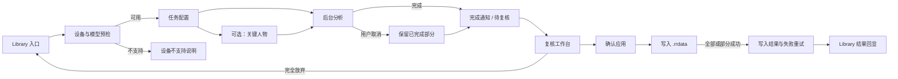

# 智能选图 V2 全生命周期 UI 与交互基线

> 版本：1.1
> 日期：2026-07-15
> 状态：设计开发基线
> 需求依据：`smart-culling-v2-requirements.md` v3.0
> 视觉依据：已选 Product Design Option 1、QRaw 当前深色桌面界面
> 可操作原型：`docs/prototypes/smart-culling-lifecycle`

## 1. 设计结论

需求文档发生了影响信息架构和状态模型的变化，因此不能只修补原复核页，需要重新生成一套完整的
全生命周期 UI。该套设计覆盖正常路径、取消路径、人工保护、设备不支持、部分写入失败和结果回显，
用于统一后续 macOS/Windows 客户端开发，而不是把单张效果图当成完整产品规格。

原型表示最终产品体验目标，不代表 P0-P3 中所有技术能力已经完成验证。生产实现仍须遵守需求文档的
技术验证门与分层交付条件。

## 2. 用户全生命周期

主流程始终遵守两条边界：分析与复核期间不写 sidecar；只有用户在确认页明确确认后才写入 `.rrdata`。

## 3. 页面清单

| 编号 | 页面 / 状态 | 用户目标 | 主操作 | 必须表达的信息 |
| --- | --- | --- | --- | --- |
| 01 | Library 入口 | 从当前文件夹快速启动 | 智能选图 | 当前文件夹、子文件夹结构、任务入口 |
| 02 | 任务配置 | 用最少步骤定义任务 | 选择一种拍摄类型、开始选图 | 固定递归范围、资产数量、人工保护、格式规则、离线说明、设备预检 |
| 03 | 关键人物 | 指定本次任务的重要人物 | 选照片、点人物、调整顺序 | 多选、顺序即优先级、仅本次任务使用与结束清理 |
| 04 | 后台分析 | 看懂真实进度并继续只读浏览 | 切换文件夹、取消任务 | 当前阶段、完成数/总数、ETA、只读限制、固定任务范围 |
| 04A | 取消分析确认 | 停止新增分析且保留已有结果 | 继续分析 / 取消并复核 | 已完成数量、未完成保持原样、原图不变 |
| 05 | 完成通知 | 决定何时进入复核 | 进入复核 | 不自动跳转、尚未写入、人工结果已保护、待复核入口持续存在 |
| 05A | 部分完成 | 复核取消前已完成部分 | 进入复核 | 部分完成数量、未完成照片保持原样 |
| 06 | 复核工作台 | 检查并修正所有建议 | 勾选、改星级/标签、筛选、确认应用 | 文件夹/故事段落、相似组、组合保护、失败项、原因、可信度、来源 |
| 06A | 人工修正保护 | 明确用户改动的长期语义 | 修改星级或标签 | 来源立即转人工、清除 AI 原因、后续任务整张保护 |
| 06B | 放弃确认 | 防止误丢弃未确认结果 | 继续复核 / 完全放弃 | 不写 sidecar、清除临时结果和人物特征、需要重新开始 |
| 07 | 确认应用 | 在写入前再次核对影响 | 确认并写入 | 采用数、人工修改数、人工跳过数、失败数、配对写入规则、基线校验 |
| 08 | 写入结果 | 处理部分失败且不影响成功项 | 重试失败项、回到 Library | 成功/失败/跳过统计、逐项原因、成功项不回滚 |
| 09 | Library 结果回显 | 在普通工作流理解最终状态 | 查看筛选/写入详情 | 星级、颜色标签、AI/人工来源、AI 原因；人工结果不显示 AI 原因 |
| 10 | 设备不支持 | 理解为什么功能不能启动 | 返回 Library | 仅禁用智能选图、不影响 QRaw 其他功能、不上传、不静默降级 |

原型右上方的“页面地图”是设计评审导航，不属于正式产品功能。

## 4. 页面详细交互

### 4.1 Library 入口

- “智能选图”与网格/列表等高频工具同层出现，不单独制造欢迎页。
- 点击后先执行设备、运行时和模型完整性预检，再进入配置。
- 已有运行中任务或待复核结果时，入口变为“查看智能选图结果”，禁止启动第二个任务。
- 任务完成只显示通知和待复核标记，不强制跳转。

### 4.2 配置

- 用户只需选择一个拍摄类型；默认选中“自动 / 混合场景”。
- 展示九种固定类型，但不把模型、阈值或强度暴露给用户。
- 关键人物仅在自动、人像、环境人像、群像、街拍/纪实模式可用；其他模式自动跳过。
- 右侧任务摘要只读显示系统已决定的递归范围、预计资产数、人工保护数和格式处理规则。
- 不提供目标数量、百分比、强度和范围切换。

### 4.3 关键人物

- 先在底部照片条选照片，再在大图中点击具体人物。
- 右侧列表按选择顺序编号，支持调整优先级和删除。
- 多位人物可同时存在；第一位最高优先级。
- 明示“仅本次任务使用”，任务完成、放弃、失败、应用退出或异常重启后清除临时数据。

### 4.4 后台分析

- Library 保持可浏览、可切换文件夹，但打星、标签、编辑、文件变更和重任务入口不可用。
- 底部面板固定显示真实阶段、完成数/总数、动态 ETA 与取消按钮。
- 取消需要二次确认；确认取消后停止新增重任务，并保留已完成结果进入待复核状态。
- 不使用模拟进度。原型中的“演示：完成分析”只用于设计评审，不进入生产客户端。

### 4.5 复核工作台

- 保持已选 Option 1 的三栏结构：左侧文件夹/故事导航，中间分组结果，右侧单图检查器。
- 成功分析结果默认全选；取消勾选表示本次不采用，不产生人工保护。
- 用户修改星级或颜色标签后，当前图片立即变为“人工”，AI 原因和可信度显示被清除，保护说明同步更新。
- 相似组展示推荐数量；普通连拍保留 3-5 张，而不是只保留一张。
- HDR、全景、堆栈等组合以整体保护状态呈现；生产实现只有在 P2 识别验证通过后才可自动宣称具体组合类型。
- 失败与跳过合并为可展开区域，但区分人工保护、解码失败、分析失败和写入冲突。
- 离开未确认复核结果必须二次确认；完全放弃后清除临时结果，不写 sidecar。

### 4.6 确认与写入

- 确认页汇总所有即将发生的变化，不重复展示整套图库。
- 确认前重新检查 `.rrdata` 基线；外部修改或冲突项跳过，不覆盖新数据。
- RAW/JPEG 同名资产有 RAW 时只写 RAW sidecar；只有非 RAW 时写该文件自己的 `.rrdata`。
- 写入允许部分成功。失败项可单独重试，其他成功结果不回滚。
- 不移动、复制或删除原图，不提供任务历史撤销。

### 4.7 普通页面结果

- 图片底部采用紧凑信息栏，统一显示星级、绿色/黄色/红色标签、AI/人工来源。
- AI 结果显示一行简洁原因；过长时省略并在正式实现中用悬停展示全文。
- 用户在普通页面修改 AI 星级或标签后，同样转为人工并清除 AI 原因。
- 普通页面不提供“批量取消智能选图”入口。

## 5. 跨页面状态规则

| 事件 | 来源 | AI 原因 | 后续保护 | 本次是否写入 |
| --- | --- | --- | --- | --- |
| AI 建议，用户未修改且确认采用 | AI | 保留 | 不保护，可被后续任务更新 | 是 |
| 用户修改 AI 星级或颜色标签 | 人工 | 立即清除 | 保护，后续任务整张跳过 | 是 |
| 用户取消采用 | 不产生结果 | 不保留 | 不保护 | 否 |
| 历史 sidecar 有星级/标签但无可靠来源 | 人工 | 不显示 | 保护 | 保持原样 |
| 分析失败、解码失败 | 无 | 无 | 无 | 否 |
| 确认前发现外部修改冲突 | 保持现状 | 保持现状 | 按最新 sidecar 判断 | 跳过并报告 |

## 6. 统一视觉规则

- 延续 QRaw 深灰黑桌面工作台，保持照片为视觉主角；不引入独立品牌色或营销式大卡片。
- 主要按钮使用近白底深色文字；危险操作使用克制红色；成功、待确认、失败分别使用绿、黄、红。
- 使用 Lucide 线性图标，避免 emoji、手绘 SVG 和 CSS 假图标。
- 圆角以 4-12 px 为主，细边框代替重阴影，信息密度适配摄影师桌面工作流。
- 1280×720 为最低原型验收窗口；关键操作不得因较小笔记本窗口而被挤出可视区域。
- macOS 与 Windows 采用同一信息架构；平台差异只处理窗口、字体回退、文件路径和快捷键。
- 第一版提供中文和英文，同一布局需为更长英文文案预留换行与省略策略。

## 7. 实施层级映射

| 层级 | UI 需要保留的目标 | 生产实现约束 |
| --- | --- | --- |
| P0 | 设备/模型预检、当前渲染状态提示、真实进度与取消 | 基准未通过前不得宣称正式设备范围或 5 分钟达标 |
| P1 | 递归扫描、资产配对、人工保护、复核确认、基线校验、失败重试、Library 回显 | 任何可发布版本必须形成完整安全闭环 |
| P2 | 九种模式有效权重、关键人物、拍摄组合识别 | 必须用真实样片和准确率验证；不得用占位逻辑伪装完成 |
| P3 | 文件夹/故事段落两级导航、跨组高效复核 | 可晚于 P1/P2，但最终体验仍以本设计为目标 |

## 8. 开发验收标准

- 从 Library 到结果回显的主路径可完整操作，无死路。
- 所有结果在最终确认前只存在于当前任务内存/临时存储，不写 `.rrdata`。
- 人工结果永不被智能选图覆盖；用户修改 AI 结果后来源、原因和保护状态同步更新。
- 分析取消、完全放弃、设备不支持、单张失败、写入冲突和部分成功均有清晰页面状态。
- 1280×720 及常见更大桌面窗口中，主操作、进度、确认和错误处理均可见可用。
- 中英文文本、键盘焦点、对比度、屏幕阅读器名称与图片替代文本通过无障碍检查。
- 真实进度、真实数量、真实原因和真实设备检测替换原型模拟数据后方可进入生产验收。
